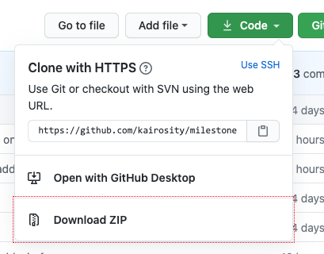
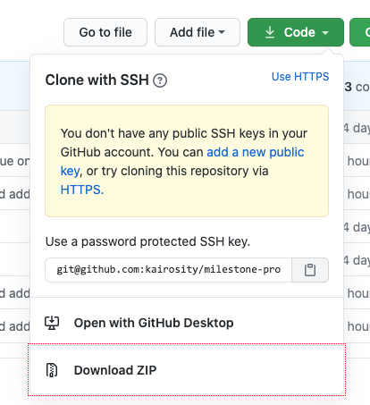

# Karina Finegan Online CV/Portfolio

## Code Institute - First Milestone Project: *User Centric Frontend Development.*

This website was developed to showcase my professional resume in an efficient and appealing online format. The key idea is for the website to act as a dual purpose calling card. 
Firstly it provides a lot of the information that would be contained in a traditional CV, and secondly it in itself works as testament to my ability to design and create static websites. 
The feeling and tone of the website is intended to be a blend of professionalism and creativity. I wanted to build a clean dark-toned site that displayed the required information in a pleasing and 
interesting way with a strong emphasis on excellent UX and accessibility. The website's primary goal is to help secure employment in web development for its primary stakeholder (me).  

## [View the Live Website Here](https://kairosity.github.io/milestone-project-1-cv-website)

---
## UX

- There are two target users: Employers & Recruiters.
- They are mostly targeted the same way. Except most recruiters will be less interested in site content and technical details and perhaps more interested in having a CV to download, take-away and pass on.
- Employers are more likely to want to browse the online resume and particularly the connected social accounts.

### User Stories

#### Project Developer 

As the sole developer and contributor to this project, my goal for this website is that it helps me futher my aim of securing employment in web development. My vested interest in creating an excellent user experience is 
thus rather deep. 

#### Tech Recruiters

* As a recruiter for a large firm, I am always looking for new talent to send my clients. 

* As a recruiter I have many clients who are looking for developers. I'd like to be able to quickly browse an online resume to get a sense of whether or not this particular developer might be a good fit for any of my clients.

* As a tech recruiter I'm not always 100% certain what languages or tools my client requires, so I would like the ability to download a detailed CV that clearly stipulates all skills clearly.

* As a tech recruiter I want to be able to look at a potential employee's online cv because it is a useful first contact for me to get a sense of a candidate's suitability. It also enables me to send my clients a link to confirm if this candidate might be a good fit.

#### Employers

* As an employer looking for a new full stack developer to join my team, I find online resumes incredibly useful to get a broad sense of someone's capabilities. 

* As an employer I might then download a more detailed CV to further help me decide whether or not to call that candidate for interview.

* As an employer looking for a new front end developer, I am heartened to see an online CV built by that potential candidate because it is an instant assurance that they know how to design and build a website. 

* As an employer who shares decision-making with others I like how easy it is to send that CV to other members of my organization as a way of fielding potential candidates. 

* I would also be interested in seeing the code behind this candidate's other projects. A link to the associated GitHub accounts is very useful to me.

#### Applicable to both target users

* As a user I would like to view this candidate's work history.

* As a user I would like to know what languages this candidate is able to work in.

* As a user I would like to see other projects this candidate has developed.

* As a user I would like a way to contact this candidate.

### Strategy
#### Project Goals
As aforementioned the focus for this project was to create a professional and slick online CV for Karina (me), that was both user-friendly and creatively designed.
I wanted the project to demonstate good design principles and use of colour, but my primary goal was to *communicate* information about myself to potential employers. 
In order for that communication to be effective, the site needed to be structured well and easily accessible. The content also needed to be relevant to the user stories. 
I was particularly cognizant of the importance of steering clear of too much unrelated personal information. 
A recruiter I spoke to said that when she's looking at candidate profiles she wants to take in the important information quickly and without "fluff".

#### Target Users
The target users are twofold: employers and recruiters. Essentially anyone who is looking to employ a front-end, back-end or full-stack developer. 

#### Research
In the planning stages I researched other online portfolios and spoke to a selection of employers as well as a recruiter to gauge what kind of site was best suited to fulfil my primary goals. 
While browsing other online CVs and portfolio sites online, I became acutely aware of the designer's pull towards style over structure and because the website is aimed at employers from a wide range of industries
I felt that it was of the utmost importance not to gallop down the road of flamboyant untethered design. 
The diversity of my target audience dictated that I maintain a strong element of professionalism, but I was also determined to inject a certain level of boldness and creativity.

#### In Summary

* The website casts a wide net for its target audience and thus must maintain a certain decorum of design and content. At the same time it must demonstrate my ability for expressing both professionalism and creativity through well-thought out design, sound UX principles and efficient, well structured coding.
* I also wanted to demonstrate an ability with a wide variety of web-development technologies. My reasoning is that employers considering me as a candidate might look at the code. It was a considered strategy from the beginning to use Bootstrap as a base and custom CSS on top of it.
* Finally I conducted qualitative research into my target audience by discussing the website in detail with a recruiter as well as a handful of other employers in less detail. The recruiter in particular gave me invaluable information about how to structure the site and what content to include. 

### Scope
The project had a somewhat clearly defined scope from its inception, as there is a well worn framework for CVs and the goal was to place that framework in an online context. I had originally intended on including some "quirky" personal information, but after
discussing the website with a recruiter, I was satisfied that such information would be out of step with the overall tone of the website. I decided to remain faithful to the accepted standard of content that one might find in a traditional CV.

I chose to include:
* Minimal personal information and a good deal of professional/employment information.
* Any personal information included is in the context of development.
* An interactive work history timeline. I wanted to make this interesting to use, and I think it manages to combine utility and design quite well.
* My skillsets and how they converge into strengths for development. 
* Projects I have worked on, and am working on. 
* A way to contact me. 

I worked my way through creating the themes for these pages in a linear fashion employing a sprint methodology. I also approached the development of the 
website with a similar method. I coded the site from the top down and if I got stuck on a particular feature I moved on and came back to it once the 
foundations were finished.

I didn't over or under scope this project, I think all the elements included have their place, and there are no glaring ommissions. 

In the future I would like to implement separate project pages as part of the main website. So where I included the project specification sheets as downloads, these would now be pages that open
via the main long scroll page. These will be dynamically generated from a central CMS, as per my mentor's recommendations. However that was well past the scope of this project, but it is something 
I will get working on when I have a better grasp of the tech needed to achieve it. 
### Structure

The traditional CV framework itself is not overly complicated so I thought it lent itself nicely to a single long scrolling page design.
My structure features a fixed top navigation that connects the user to each of the sections from anywhere on the page. The narrative is linear as the website tells a story
with a natural flow.

#### Website Sections:

1. **Home / Landing page.**
2. **Personal Bio.** - A brief paragraph of semi-personal information in the context of development alongside a photograph of myself.
3. **Work History** - My work and education history displayed as an interactive timeline. 
4. **Skills** - My professional skillset listed and divided into boxes and with some information about new skills and languages I am learning with Code Institute.    
5. **Portfolio** - This consists of past and present selected projects - some with links to live sites and some with links to download their project specification sheets.
6. **Contact** - A contact page featuring a contact form. 
7. **Footer** - This isn't a headed section, rather a natural ending with social-media navigation and the option to download my traditional CV, and a quick "back to top" button
to encourage further browsing.  

#### Website Flow
The flow of the site is simple and makes the logical linear progression from: 
Introduction to Karina --> Work History --> Skillset --> Some examples of Skillset --> Contact. 
The user might choose their own path and skip ahead, but the site has been designed to try and maintain their focused interest 
throughout the journey towards the end goal of sending me an email, or downloading my traditional CV. 

#### Interaction Design

Interaction design was foremost in my mind when outlining the way the site would work. As the website is selling my ability to 
create websites, every aspect of the user's interaction is of the highest importance. My colours, typography and layout structure 
have all been chosen and designed with an eye to clarity and consistency. Whenever possible a user's interaction is given feedback. Specifically:

- Interactive elements are given a state change of colour or underline or both when they are hovered over or focused on.
- I've included animated down arrows at choice positions throughout the page flow as content hinters to encourage and indicate that the user should continue to 
scroll. 
- I've encouraged easy navigation by including both top and footer hierarchical navigation on mobile and medium screens.
- The design has been conceived to offer the user reassurance at every stage of their progression through the website.
- All buttons, navbars and forms work the way the user would expect. Of note is that I modified the mobile navigation to improve UX and I've detailed this further below.
- I spent an inordinate amount of time ensuring that my "departure from the norm timeline" would work regardless of what the user decided to do, 
or how they decided or needed to interact with it. These details are explored further in Testing. (link here).

#### Information Architecture

A standard linear tree structure worked perfectly for this project, and I saw no need to add needless complexity in the form of off-page linkage. When I do implement the dynamic 
project pages, the website will likely develop into more of a hub and spoke style system, but a simple one at that.

### Skeleton

As already mentioned, the website is designed with a simple tree structure and hierarchical flow from top to page bottom. It is designed to be clear
and simple, browsing the site is all about information collection and the user should not need to pay attention to the fact that they are "using"
anything. I think this project has achieved those aims.

#### Designed to lead the user to my CTA
The content was structured in the particular order to lead up to my call to action, which is for an employer or a recruiter to get in touch to learn more. 

#### Reassuring Conventions

I've employed conventions that my target users will already be accustomed to:
- My navigation is conventional: a fixed navbar on medium and large screens, reducing to a hamburger on smaller ones. 
- My landing page clearly and very simply explains to the user why they are here and what is expected of them.
- My personal bio page immediately follows on from the landing page and it expounds on the initial message. Leaving no doubt as to what the point of the website is, 
or what the user's role is.
- The only somewhat left of center design choice is the interactive timeline that follows. I think it adds a nice amount of flair and creativity,
 without detracting from usability. I spent a good deal of time ensuring that the timeline was user-friendly and accessible to keyboard users as well. 
 - To ensure good UX I also added instructions to the user explaining exactly how to interact with the timeline. These instructions change depending on device and screen size.
 - I've sprinkled Font Awesome icons liberally throughout the site to encourage metaphorical thinking and to further reassure the user and reinforce the information on display. 

#### Wireframes

My wireframes enabled me to get a sense of how this structure would look on the page, and they provided the foundation for more detailed design choices later in the process.

[My full Figma workspace can be viewed here.](https://www.figma.com/file/R1rKGdgD34jz9jH3s9oMJd/Personal-CV?node-id=115%3A0)

#### *Alternatively here are the individual wireframes in pdf format:* 

- [xs Wireframe (Default mobile-first) ](wireframes-et-al/xs-wireframe-default.pdf) 
- [sm Wireframe](wireframes-et-al/sm-wireframe.pdf)
- [md Wireframe](wireframes-et-al/md-wireframe.pdf)
- [lg Wireframe](wireframes-et-al/lg-wireframe.pdf)
- [xl Wireframe](wireframes-et-al/xl-wireframe.pdf)

### Surface

Once the structure, information architecture and wireframing was completed, the choice of design elements, colours, typography and creative flourishes, were actually very simple to add. I knew I 
wanted a dark-toned website, but I still created a few alternative mock-ups to see how they felt. The alternatives cemented my initial instinct for how I wanted the site to look and feel. 

#### *Palette & Typography Tests*

- [Palette & Typography Mock-Ups](wireframes-et-al/palette-typography-tests.pdf)

#### Colour Palette
My initial strategy was intimately linked to surface design as I went with a weighty dark-toned colour palette to add gravitas to my content and I then lightened this with a playful creative throw-pillow of colour. I was also very conscious 
of maintaining colour contrast for accessibility reasons, and my choice of a bright yellow/green fit the brief well. In my initial mock-ups I had planned to use black writing on a dark grey, because I love the rich velvety tone and feel of that 
combination, but I realised early on that the contrast was not user-friendly, so I changed most of my black text to either light-grey or the green/yellow accent colour.

I was also aware of not using pure black as a background colour, I've seen many websites that make this mistake to the detriment of the user. A dark grey that passes for a matte black is always a better base colour, as the contrast
doesn't hurt your user's eyes. For the same reasons I didn't overuse bright white, most of my light tones are actually a very light grey. I also chose a dark grey base with softer brown undertones as it is a warming and comforting colour.

I did detailed colour mock-ups before starting development, but as you can from the links below I did go on to change some of the pairings.

#### *Mock-ups*

- [Mobile Mock-up](wireframes-et-al/mock-up-for-mobile.pdf)
- [Desktop Mock-up](wireframes-et-al/mock-up-for-desktop.pdf)

I ended up refining the Portfolio section of the project quite a bit during development but the remaining sections stayed mostly true to my 
wireframing and mock-ups.

#### Typography
I focused on using two of my favourite Google fonts: Lato and Roboto. They are clean, elegant, no-nonsense fonts, easy to read, without being boring. I think my font pairing works well for the professional-creative look I was aiming for. Obviously
they are both sans-serif, as are their fallbacks. I experimented briefly with serif fonts during the typography tests, but decided they were not the right fit.   

#### Use of Language 
- My landing page language is bold and somewhat brazen, but the idea behind it is to grasp user attention. 
- Throughout the site I use language to reinforce my main goal of securing employment in development:
    - On the landing page. 
    - In the personal bio. 
    - At the end of the work history timeline. 
    - At the beginning of the skills section with a call to download my CV.
    - On the contact page I've used the more colloquial "Get in Touch" to encourage the latter.
    - In the footer I have "Connect with me" and links to other places to see my work.
    - Also in the footer I've engaged differently with the user by asking them a question. "Prefer a more traditional CV?"  This is well-known sales technique to illicit a positive response which elicits other
    positive responses. 
- I've kept the language in the main body of the site professional and to the point.

## Features

### 1. Navigation Bar - Fixed Bootstrap Navbar.

The navigation is a fixed top Bootstrap navbar with some key alterations to its default behaviour: 

- It has been altered via jQuery so that the active class switches from tab to tab as the site is browsed. I found code that achieved this online and I altered it to work on this website. (Attribution below).

- From a UX perspective I found it irksome that a mobile user had to click directly on the hamburger icon to close the navigation, even after tapping on where they wanted to navigate to. Again I found code online which I altered 
to work for this website. (Attribution below.) Now, once a user clicks on a navigation tab, the user is brought there and the navigation options close, so they can see the page. Also, if they click anywhere outside the nav drop-down,
it also closes. I think this is far preferable to Bootstrap's default behaviour.  

### 2. Landing Page / Home

This was designed to be very minimal, with a strong, bold introduction to myself and the site's purpose. I think it achieves that. Initially I had toyed with adding my profile photo to the landing page, but I much prefer the minimalism of just 
bold text.

### 3. Short personal biography & photo of Karina

I wasn't sure about including this page, but I was convinced by both a recruiter and an employer that a basic introduction and photograph would be beneficial, as people like to be able to place a face to go with information. I concede that the 
CV is made more solid when there is a real person attached to it. 

The page is fully responsive and I ensured that I compressed the image, so as not to impact load times unnecessarily.

### 4. Work History

This section comprises of an interactive timeline of my education and work history to date. I find employment histories in their usual format to be a little bit tedious, and since I'm also offering a traditional CV for download, I thought it would be
nice to have a little fun with this section. I had (perhaps naively) imagined that I would be able to implement this easily with CSS, but I found that JavaScript was required to get the behaviour I needed. Thankfully the internet is replete with developers 
doing pretty much everything conceivable in JavaScript and I found code that helped me to begin to acheive the desired effect. I had to modify and add to this code quite a lot and I drew from multiple sources online (all attributed). This section went through 
many permutations in order to create an interactivity that was both interesting and different, but also accessible. I was especially aware of the inherent dangers of using hover effects for keyboard users. I have documented the JavaScript in the script.js file, 
so I won't go into the details here. 

To make hovering over the items easier for the user, I increased the width of the icon space and as the Font Awesome icons are fonts, the increase in width just enabled me to increase the hover zone without affecting the size of the icon itself. I had to adjust 
this for smaller screens because it was too difficult then to click away from the "modal" timeline information.

As this section is slightly unconventional I have included an instruction to the user at the beginning of the timeline, to either tap & click or hover & focus (the instruction varies by device used, and screen width). I've also ensured that the icons scale up and 
change colour when they are hovered over, as extra confirmation for the user. 

### 5. Skills

This page features a list of skills that enhance and add to my employability as a professional web developer. As the page is heavy on content, I have made it more accessible by demarcating the various skills into categories and 
further subdividing them into boxes which I think enables the design to flow smoothly and displays the information in a way that is easy to read. I've incorporated a more graphical visual in the form of the progress bar graph which 
currently displays more aspirational than factual progress results, but I will update these to reflect my actual progress before I send this website to potential employers. 

I've included a number of elements intended to retain the user's attention: 
- I chose to animate the UX/UI box in a way that both entertains and reinforces the design implication that those particular boxes are "tacked" on to the background.
- I've broken up the content into a lot of smaller more manageable pieces that are easier to consume. 
- I've sliced through the boxyness of the page with a bright border on the TOOLS section. 
- I've added the rather arbitrary progress bars at the bottom to reinforce the idea that I am making headway with a number of languages and technologies. 

* Selected Projects

* Contact Page

* Footer

    * I made the choice to include both my social navigation and my main navigation in the footer as well as via the main nav-bar. 
    I am aware that this might be considered somewhat redundant given that my main navbar is fixed and easily accessible from the footer area, however 
    I persisted with this decision, because on small screens and medium screens up to 992px, the main navigation is hidden behind the hamburger icon and the upper social media links are 
    quite small, thus easily ignored.  &nbsp;&nbsp;&nbsp;&nbsp;&nbsp;&nbsp;Ultimately I didn't think the downside of redundancy outweighed the positives of potentially reminding a user to connect with me on social media, or have another look at part of my website.
    I included both of these CTAs as titles over the footer navigation. I did however remove the main navigation links from the footer on screens above 992px as at this size the navbar is completely visible.

## Accessibility

* My original design had far more dark on dark toned elements, which I love the look of, but after having checked the site and colour themes using the Web Disability Simulator,
I realised my colour choices were problematic for a subsection of potential users. So I chose to use more of the light grey and yellow tones for text elements.

* I had initially changed the inputs on my contact form so that when a user clicks into an input to type, the placeholder would disappear, as below:  
<input type="text" placeholder="Name:" required onfocus="this.placeholder=''" onblur="this.placeholder='Name:'">  
I wrote it like this because I personally find it off-putting to type over something already written. However, I then researched placeholder functionality online and found that this was not acceptable HTML standard. 
in terms of usability. So I changed it back to the following:  
<input type="text" placeholder="Name:" required>  
Which I personally find annoying, but the consensus is that this way is more user-friendly, especially when not including form labels, which I have chosen to omit for design reasons.

* After running my site through web.dev I found that I need to add aria-labels to my form inputs and button, for SEO, screen-readers & accessibility. 

## Future Features to Implement

* I plan to turn this website into a dynamic site, whereby specific project pages are generated dynamically after inputting certain key variables. Title, goal, colour palette, images etc... (Example in wireframe).

* I plan to implement the sequential loading of elements on scroll. So as the user scrolls down elements pop into view.

* I plan to password protect my downloadable traditional CV, as I don't want all my personal details to be readily available online. Once I've instituted that feature I will upload my actual CV as opposed to the dummy one that is currently there.

## Issues / Room for Improvement

* *Unused CSS*: As per web-dev Measure results I tested my CSS via Chrome dev tools' "Coverage" tool and found that there was a substantial amount of unused CSS.
For this particular site, the load time is quite fast, so I don't think this is a massive issue, but there is definitely scope for reducing the size of the Bootstrap and Font Awesome libraries.

* *Cache Policy*: As per Chrome Dev Tools: Lighthouse - I need to "serve my static assets with an efficient cache policy" but as this is beyond the scope of this project I will implement this at a later date, when I know more server-side programming.

## Tools & Other Resources Used & Perused
Here are the additional tools and resources I used during all stages of this project: 

### **[Figma](https://www.figma.com/)**

My project planning, wireframes initial colour palette & typography testing were all done using Figma.

### **[Adobe Photoshop](https://www.adobe.com/ie/products/photoshopfamily.html)**

Editing and colour correction for the images was done using Adobe Photoshop.

### **[Chrome Dev Tools](https://developers.google.com/web/tools/chrome-devtools)**

Used a LOT for testing CSS and shaping the jQuery code to work for my project.

### **[Chrome Dev Tools: Lighthouse](https://developers.google.com/web/tools/lighthouse#devtools)**

Amazing for checking a number of site performance indicators. 

### **[Google Fonts](https://fonts.google.com/)**

Both the fonts I've included are Google Fonts: Lato & Roboto.

### **[Font Awesome](https://fontawesome.com/)** 

All the awesome icons used are from Font Awesome.

### **[W3 CSS Validator](https://jigsaw.w3.org/css-validator/)** & **[ W3 HTML Validator](https://validator.w3.org/)**

### **[W3C Editor's Draft](https://drafts.csswg.org/mediaqueries-4/#hover)** 
Great information on using :hover media queries.

### **[CSS Tricks](https://css-tricks.com/)**
Specifically their pages on:

* [Box Shadows](https://css-tricks.com/almanac/properties/b/box-shadow/https://css-tricks.com/almanac/properties/b/box-shadow/)
* [Flexbox](https://css-tricks.com/snippets/css/a-guide-to-flexbox/)
* [Grid](https://css-tricks.com/snippets/css/complete-guide-grid/)
* [TextArea](https://css-tricks.com/textarea-tricks/)
* [Unused CSS](https://css-tricks.com/how-do-you-remove-unused-css-from-a-site/)

### **[freeCodeCamp](https://www.freecodecamp.org/)**
Specifically [This article](https://www.freecodecamp.org/news/time-saving-css-techniques-to-create-responsive-images-ebb1e84f90d5/) about all the ways to create responsive images. 

### **[Web Disability Simulator - Chrome Extension](https://chrome.google.com/webstore/detail/web-disability-simulator/olioanlbgbpmdlgjnnampnnlohigkjla?hl=en)**
Used this to check my design and page layout for accesibility concerns. 

### **[Unsplash](https://unsplash.com/)**
Specifically: 
* Photo by <a href="https://unsplash.com/@bekirdonmeez?utm_source=unsplash&amp;utm_medium=referral&amp;utm_content=creditCopyText">Bekir Dönmez</a> on <a href="https://unsplash.com/s/photos/acupuncture?utm_source=unsplash&amp;utm_medium=referral&amp;utm_content=creditCopyText">Unsplash</a>
* Photo by <a href="https://unsplash.com/@lougoetzmann?utm_source=unsplash&amp;utm_medium=referral&amp;utm_content=creditCopyText">Lou Goetzmann</a> on <a href="https://unsplash.com/s/photos/ireland-history?utm_source=unsplash&amp;utm_medium=referral&amp;utm_content=creditCopyText">Unsplash</a>

### **[jQuery Documentation](https://api.jquery.com/)**

### **[Autoprefixer - CSS](https://autoprefixer.github.io/)**
Amazing tool that adds all the browser prefixs automatically.

### **[Can I Use?](https://caniuse.com/)**
Checks web development features for browser compatibility. 

### **[dirtyMarkup by 10 Best Design](https://www.10bestdesign.com/dirtymarkup/)**
HTML, CSS, JS & API code formatter. Super useful resource thanks to Richard Read (Readri205 @ Code Institute) for the link. 

### **[Google's Style Guide](https://google.github.io/styleguide/htmlcssguide.html)**
Useful reference for formatting/style information.

### **[Google's Web.Dev Measure](https://web.dev/measure/?gclid=EAIaIQobChMIk-icrKKb6wIVQeztCh2zaAQFEAAYASAAEgKVJfD_BwE)**
Useful for testing various site performance and user experience markers.  

### **[Image Optim](https://imageoptim.com/mac)**
Great little program to compress images for use online. 

### **[Access & Use](https://accessuse.eu/en/Content-hover-focus.html)**
Information on hover/focus based accessibility.

---

## Technology Used

* HTML5

* CSS3

* Bootstrap

* jQuery

* GitHub

* GitPod

* Git 

## Testing 

1. List websites used to validate my code

2. Go through User Stories and explain how website meets those needs. 

3. Write about how each part of responsive website behaves on different screen sizes. 

4. Manually go through each part of website and write out how I confirmed that each link, hover effect and other interactive bits worked as expected. 

5. List any bugs I came across while creating and testing the site, including fixes I came up with. 

1. web.dev Measure was amazing for checking a range of different measures of page performance, accessibility, vulnerabilities and best practices. 
    * I went through the list a few times and changed/altered elements on my page to try and improve those markers of performance that I could.

    * I altered my code so that my headings descended sequentially. Initially I had skipped from h1s to h4s in a number of sections. 
    * I added rel="noopener" to my target="_blank"'s as per their recommendation.
    * I used Chrome's development tools' "Coverage" tab to see how much unused CSS I had, but then chose to leave it for the time being as it does not impact substantially 
    on page load time, although for larger projects it is definitely something worth considering re: external libraries. 
    * I added a meta description. 

## Attribution

#### [Will Chow's jQuery Code.](https://jsfiddle.net/wilchow/4hzenxkh/) 
The jQuery code I used and altered to display the Work History Timeline information on hover/click.  

#### [@dynamyc-2's jQuery code](https://css-tricks.com/forums/topic/jquery-window-width-condition/)
I used and altered the first line from this user's question on CSS Tricks.

#### [MatuDuke's Code from Stack Overflow](https://stackoverflow.com/questions/9707021/how-do-i-auto-hide-placeholder-text-upon-focus-using-css-or-jquery/9707068#9707068)
I used this user's answer (2nd from the top) to hide the placeholder text in my contact form when the user clicks to type something, as I think it's off-putting when the placeholder 
text remains until you actually type.

#### [Taha Paksu's Code from Stack Overflow](https://stackoverflow.com/questions/10750603/detect-a-window-width-change-but-not-a-height-change)
I used this code to stop the browser reloading on mobile devices when a user scrolls vertically. 

#### [Mitra's Code from Stack Overflow](https://stackoverflow.com/questions/50668594/remove-border-color-for-navbar-toggler-hamburger-icon-bootstrap-4)
I used this user's answer (2nd from top) to change the colour of my bootstrap hamburger icon when active or focus states were triggered. 

#### [Pete TNT's Code from Stack Overflow](https://stackoverflow.com/questions/24514717/bootstrap-navbar-active-state-not-working)
I used and altered this code to make my Bootstrap navbar work the way it should regarding the active class.

#### [Nozzleman's Code from Stack Overflow](https://stackoverflow.com/questions/23764863/how-to-close-an-open-collapsed-navbar-when-clicking-outside-of-the-navbar-elemen)
I used and altered this code to make the navbar close when a user clicks away from it on mobile devices. The Bootstrap default is that you have to click on the hamburger icon to 
close the navigation, and I would questions how user-friendly this is. In addition, the Bootstrap default behaviour is that even when a user clicks on a navigation link, the navigation
stays open and they have to click the icon to close it. I think this code improves upon the default behaviour. 

## Deployment

1. Write up how I got the site deployed on GitHub Pages:
https://docs.github.com/en/github/working-with-github-pages/configuring-a-publishing-source-for-your-github-pages-site

This site is currently hosted on GitHub pages. 

### 1. To view the live site: [Follow this link](https://kairosity.github.io/milestone-project-1-cv-website)

### 2. To open this project locally:

You have to clone the project on GitHub, you can do this via the Command Line or using GitHub Desktop.

#### Using the Command Line

1. Go to the main page of [this project's repository on GitHub.](https://github.com/kairosity/milestone-project-1-cv-website) The page with the full list of files and the README doc underneath.

2. Click on the button that says "Code" with a down arrow before the text.

3. To clone using HTTPS click the clipboard icon pictured next to the repository link.

4. To clone using SSH click the blue link on the upper right hand side that says "Use SSH" and then click the clipboard icon to copy. 

5. Here is some more information on [which remote URL to use](https://docs.github.com/en/github/using-git/which-remote-url-should-i-use) if you're not sure.

6. In your IDE or directly in your terminal navigate to the directory that you would like the cloned project to live in.

7. Type git clone and paste in the URL you copied in step 3 or 4.

8. Press enter to create a local clone. Done!

#### Using GitHub Desktop

1. Go to the main page of [this project's repository on GitHub.](https://github.com/kairosity/milestone-project-1-cv-website) The page with the full list of files and the README doc underneath.

2. Click on the button that says "Code" with a down arrow before the text.

3. Click on "Open with GitHub Desktop".

4. Follow the prompts provided by GitHub Desktop.

## Acknowledgements

Thank you to my friends and family for doing usability testing for me on various devices, and for giving me feedback.  
Special thanks to Cristina Cista for her professional input. 
Thanks to the Code Institute Slack Community for their resources and information.  
Thank you to my Code Institute mentor Oluwafemi Medale for his invaluable insight and instruction. 

