# **Karina Finegan Online CV/Portfolio**

## Code Institute - First Milestone Project: *User Centric Frontend Development.*

This project was developed to showcase my professional resume in an efficient and appealing online format. The website will act as a two-pronged calling card. 
Firstly it provides a lot of the information that would be contained in a traditional CV, and secondly it is evidence of my ability to design and create static websites. 
The design mood is intended to be a subtle blend of professionalism and creativity. I wanted to create a clean dark-toned site that displayed the required information in a pleasing and 
interesting way with a strong emphasis on excellent UX and accessibility. The website's primary goal is to help illustrate my suitability for employment in web development.

<a href="https://kairosity.github.io/milestone-project-1-cv-website">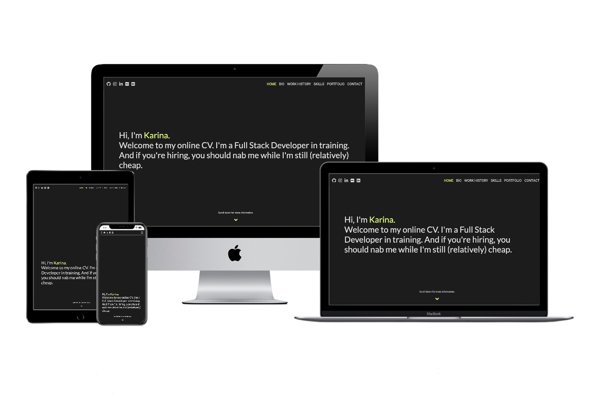</a>

## [View the Live Website Here](https://kairosity.github.io/milestone-project-1-cv-website)

---

## Table of Contents

- [1. UX](#ux)
  * [1.1 User Stories](#user-stories)
      - [*Project Developer*](#-project-developer-)
      - [*Applicable to both target users*](#-applicable-to-both-target-users-)
      - [*Tech Recruiters*](#-tech-recruiters-)
      - [*Employers*](#-employers-)
      - [*Returning Visitors*](#-returning-visitors-)
  * [1.2 Strategy](#strategy)
      - [*Project Goals*](#-project-goals-)
      - [*Target Users*](#-target-users-)
      - [*Research*](#-research-)
      - [*In Summary*](#-in-summary-)
  * [1.3 Scope](#scope)
  * [1.4 Structure](#structure)
      - [*Website Sections:*](#-website-sections--)
      - [*Website Flow*](#-website-flow-)
      - [*Interaction Design*](#-interaction-design-)
      - [*Information Architecture*](#-information-architecture-)
  * [1.5 Skeleton](#skeleton)
      - [*Designed to lead the user to my CTA*](#-designed-to-lead-the-user-to-my-cta-)
      - [*Reassuring Conventions*](#-reassuring-conventions-)
      - [*Wireframes*](#-wireframes-)
      - [*Alternatively here are the individual wireframes in pdf format:*](#-alternatively-here-are-the-individual-wireframes-in-pdf-format--)
  * [1.6 Surface](#surface)
      - [*Palette & Typography Tests*](#-palette---typography-tests-)
      - [*Colour Palette*](#-colour-palette-)
      - [*Mock-ups*](#-mock-ups-)
      - [*Typography*](#-typography-)
      - [*Use of Language*](#-use-of-language-)
- [2. Features](#features)
  * [2.1 Navigation](#1-navigation)
    + [Design](#design)
    + [Responsiveness](#responsiveness)
    + [Elements to Note](#elements-to-note)
  * [2.2 Landing Page / Home](#2-landing-page---home)
    + [Design](#design-1)
  * [2.3 Short personal biography & photo of Karina](#3-short-personal-biography---photo-of-karina)
  * [2.4 Work History](#4-work-history)
    + [Design & Concept](#design---concept)
    + [Accessibility](#accessibility)
  * [2.5 Skills](#5-skills)
    + [Design & Concept](#design---concept-1)
    + [UX](#ux-1)
  * [2.6 Portfolio](#6-portfolio)
    + [Design & Concept](#design---concept-2)
    + [Responsiveness & Images](#responsiveness---images)
  * [2.7 Contact Page / Get in Touch](#7-contact-page---get-in-touch)
  * [2.8 Footer](#8-footer)
- [3. Accessibility](#accessibility-1)
- [4. Future Features to Implement](#future-features-to-implement)
- [5. Testing](#testing)
  * [5.1 Code Validators](#code-validators)
  * [5.2 UX Goal Testing](#ux-goal-testing)
  * [5.3 Mobile-first Responsivity](#mobile-first-responsivity)
    + [Mobile/xs & sm breakpoints](#mobile-xs---sm-breakpoints)
    + [Md breakpoint](#md-breakpoint)
    + [Lg breakpoint](#lg-breakpoint)
    + [Xl breakpoint](#xl-breakpoint)
  * [5.4 Manual Testing](#manual-testing)
  * [5.5 Bugs & Fixes](#bugs---fixes)
    + [Landing Page & Contact Page](#landing-page---contact-page)
    + [Work History](#work-history)
  * [5.6 Other Testing](#other-testing)
- [6. Issues / Room for Improvement](#issues---room-for-improvement)
- [7. Attribution](#attribution)
- [8. Deployment](#deployment)
  * [8.1 How I Published to GitHub Pages:](#how-i-published-to-github-pages-)
  * [8.2 To fork this GitHub repository:](#to-fork-this-github-repository-)
  * [8.3 To open this project locally:](#to-open-this-project-locally-)
    + [Using the Command Line](#using-the-command-line)
    + [Using GitHub Desktop](#using-github-desktop)
- [9 Tools & Other Resources Used & Perused](#tools---other-resources-used---perused)
  * [9.1 Design](#1-design)
  * [9.2 HTML & CSS Code](#2-html---css-code)
  * [9.3 jQuery Code](#3-jquery-code)
  * [9.4 Accessibility & Performance](#4-accessibility---performance)
  * [9.5 General Resources](#5-general-resources)
- [10. Technology Used](#technology-used)
- [11. Acknowledgements](#acknowledgements)

# UX

- There are two target users: Employers & Recruiters.
- They are targeted in much the same way. However, recruiters may be slightly less interested in site content and technical details and slightly more inclined to download a traditional CV to take-away and pass on to other decision-makers.
- On the other hand, employers are more likely to want to browse the online resume and are more likely to be interested in the connected GitHub account.

## User Stories

#### *Project-Developer* 

As the sole developer and contributor to this project, my goal for this website is that it helps me futher my aim of securing employment in web development. My vested interest in creating an excellent user experience is 
therefore rather deep. 

#### *Applicable to both target users*

* As a user I would like to be able to quickly and easily understand the purpose of this website.

* As a user I want to be able to easily navigate this website, using a mouse or a keyboard, or screen reader technology.

* As a user I would like to view this candidate's work and education history.

* As a user I would like to know what languages this candidate is able to work in.

* As a user I would like to see examples of projects this candidate has developed.

* As a user I would like a way to contact this candidate.

#### *Tech Recruiters*

* As a recruiter for a large firm, I am always looking for new talent to send my clients. 

* As a recruiter I have many clients who are looking for developers. I'd like to be able to quickly browse an online resume to get a general sense of whether or not this particular developer might be a good fit for any of my clients.

* As a tech recruiter I'm not always 100% certain what languages or tools my client requires, so I would like the ability to download a detailed CV that clearly outlines the candidate's skills.

* As a tech recruiter I want to know about the specific skills a candidate has and whether they apply to SMEs or large corporations. 


#### *Employers*

* As an employer looking for a new full stack developer to join my team, I find online resumes incredibly useful to get a broad sense of someone's capabilities. 

* As an employer I would like a more detailed CV to further help me decide whether or not to call that candidate for interview.

* As an employer looking for a new front end developer, I am heartened to see an online CV built by that potential candidate because it is an instant assurance that they know how to design and build a website. 

* As an employer who shares decision-making with others I like how easy it is to send that CV to other members of my organization as a way of fielding potential candidates. 

* As an employer I would also be interested in seeing the code behind this candidate's other projects. A link to the associated GitHub accounts is very useful to me.

* As an employer who runs an SME I would like an online portfolio to tell me what experience a candidate has specific to my type of business.

#### *Returning Visitors*

* As a returning user, I want to see if there are any new portfolio examples on display. 
* As a returning user, I want to see if there are new additions to this candidate's GitHub account.


## Strategy
#### *Project Goals*
As aforementioned the focus for this project was to create a professional and slick online CV for Karina (me), that was both user-friendly and creatively designed.
I wanted the project to demonstate good design principles and use of colour, but my primary goal was to *communicate* information about myself to potential employers. 
In order for that communication to be effective, the site needed to be easily accessible and well-structured. The content also needed to be relevant to the user stories. 
I was particularly cognizant of the importance of steering clear of too much unrelated personal information. 
A recruiter I spoke to informed me that when she's looking at candidate profiles she wants to be able to access the relevant information easily.

#### *Target Users*
The target users are twofold: employers and recruiters. Essentially anyone who is looking to employ a front-end, back-end or full-stack developer. 

#### *Research*
In the planning stages I researched other online portfolios and spoke to a selection of employers as well as a recruiter to gauge what kind of site was best suited to fulfil my primary goals. 

Speaking to a recruiter was particularly useful, specifically with regards to the type of biography to write:

> "You have done a lot of work for SMEs and you have run an SME yourself. I would want to know that you have that experience and are looking for projects where that can be beneficial. So as an agency I would know why 
I'm introducing you to my SME clients. As an SME employer I would feel reassured that you understand my needs." 


While browsing other online CVs and portfolio sites online, I became acutely aware of the designer's pull towards style over structure and because the website is aimed at employers from a wide range of industries
I felt that it was of the utmost importance not to gallop down the road of flamboyant untethered design. 
The diversity of my target audience dictated that I maintain a strong element of professionalism, but I was also determined to inject a certain level of boldness and creativity.


#### *In Summary*

* The website casts a wide net for its target audience and thus must maintain a certain decorum of design and content. At the same time it must demonstrate my ability to express both professionalism and creativity through well-thought out design, sound UX principles and efficient, well structured coding.
* I also wanted to demonstrate an ability with a wide variety of web-development technologies. My reasoning is that employers considering me as a candidate might look at the code. It was a considered strategy from the beginning to use Bootstrap as a base and custom CSS on top of it.
* Finally I conducted qualitative research into my target audience by discussing the website in detail with a recruiter as well as a handful of other employers in less detail. The recruiter in particular gave me invaluable information about how to structure the site and what content to include. 

## Scope
The project had a somewhat clearly defined scope from inception, as there is a well worn framework for CVs and the goal was to place that framework in an online context. I had originally intended to include some "quirky" personal information, but after
discussing the website with a recruiter, I was satisfied that such information would be out of step with the overall tone of the website. I decided to remain faithful to the accepted standard of content that one might find in a traditional CV.


I chose to include:
* Minimal personal information and a good deal of professional/employment information.
* Any personal information included is in the context of development or past experience.
* An interactive work history timeline. I wanted to make this interesting to use, and to combine utility and good design.
* My skillsets and how they converge into strengths for development. 
* Past and current projects. 
* A means of contacting me directly. 

I worked my way through creating the themes for these pages in a linear fashion employing a sprint methodology. I also approached the development of the 
website in a similar fashion.

I didn't over or under scope this project, I think all the elements included have their place, and there are no glaring ommissions. 

## Structure

The traditional CV framework itself is not overly complicated so I thought it lent itself nicely to a single long scrolling page design.
My structure features a fixed top navigation that connects the user to each of the sections from anywhere on the page. The narrative is linear as the website tells a story
with a natural flow.


#### *Website Sections:*

1. **Home / Landing page.**
2. **Personal Bio.** - A brief paragraph of semi-personal information in the context of development alongside a photograph of myself.
3. **Work History** - My work and education history displayed as an interactive timeline. 
4. **Skills** - My professional skillset listed and divided into boxes and with some information about new skills and languages I am learning with Code Institute.    
5. **Portfolio** - This consists of past and present selected projects - some with links to live sites and some with links to download their project specification sheets.
6. **Contact** - A contact page featuring a contact form. 
7. **Footer** - This isn't a headed section, rather a natural ending with social-media navigation and the option to download my traditional CV, and a quick "back to top" button
to encourage further browsing.  


#### *Website Flow*
The flow of the site is simple and makes the logical linear progression from:<br>
Introduction to Karina --> Work History --> Skillset --> Some examples of Skillset --> Contact.<br>
The user might choose their own path and skip ahead, but the site has been designed to try and maintain their focused interest 
throughout the journey towards the end goal of sending me an email, or downloading my traditional CV. 

#### *Interaction Design*

Interaction design was foremost in my mind when outlining the way the site would work. As the website is selling my ability to 
create websites, every aspect of the user's interaction is of the utmost importance. My colours, typography and layout structure 
have all been chosen and designed with an eye to clarity and consistency. Whenever possible a user's interaction is given feedback. Specifically:

- Interactive elements are given a state change of colour or underline or both when they are hovered over or focused on.
- I've included animated down arrows at choice positions throughout the page flow as content hinters to encourage and indicate that the user should continue to 
scroll. 
- I've encouraged easy navigation by including both top and footer hierarchical navigation on mobile and medium screens.
- The design has been conceived to offer the user reassurance at every stage of their progression through the website.
- All buttons, navbars and forms work the way the user would expect. Of note is that I modified the mobile navigation to improve UX and I've detailed this further below.
- I spent an inordinate amount of time ensuring that my "departure from the norm timeline" would work regardless of what the user decided to do, 
or how they decided or needed to interact with it. These details are explored further in the Testing section of this README.

#### *Information Architecture*

A standard linear tree structure worked perfectly for this project, and I saw no need to add the extra complexity of a multiple page site. When I do implement the dynamic 
project pages that I mention in [future features to implement](#future-features-to-implement), the website will likely develop into more of a hub and spoke style system, but a simple one at that.

## Skeleton

The website's simple tree structure flows hierarchically from top to page bottom. It is designed to be clear
and simple. Browsing the site is all about information collection and the user should not need to pay attention to the fact that they are "using"
anything.

#### *Designed to lead the user to my CTA*
The content was structured specifically so as to lead organically towards my call to action, which is for an employer or a recruiter to get in touch to learn more. 

#### *Reassuring Conventions*

I've employed conventions that my target users will already be accustomed to:
- My navigation is conventional: a fixed navbar on medium and large screens, reducing to a hamburger on smaller ones. 
- My landing page clearly and very simply explains to the user why they are here and what is expected of them.
- My personal bio page immediately follows on from the landing page and it expounds on the initial message leaving no doubt as to what the point of the website is 
or what the user's role is.
- The only somewhat left of center design choice is the interactive timeline that follows. The aim with the timeline was to add a certain amount of flair and creativity,
 without detracting from usability. I spent a good deal of time ensuring that the timeline was user-friendly and accessible to keyboard users as well. 
 - To ensure good UX I also added instructions to the user explaining exactly how to interact with the timeline. These instructions vary depending on the device being used and screen size.
 - I've sprinkled Font Awesome icons liberally throughout the site to encourage metaphorical thinking and to further reassure the user and reinforce the information on display. 

#### *Wireframes*

My wireframes enabled me to get a sense of how this structure would look on the page, and they provided the foundation for more detailed design choices later in the process.
<a href="https://www.figma.com/file/R1rKGdgD34jz9jH3s9oMJd/Personal-CV?node-id=115%3A0"></a>
[My full Figma workspace can be viewed here.](https://www.figma.com/file/R1rKGdgD34jz9jH3s9oMJd/Personal-CV?node-id=115%3A0)

#### *Alternatively here are the individual wireframes in pdf format:* 
If you choose to view them this way, please click download as the GitHub viewer expands the smaller wireframes too much.

- [xs Wireframe (Default mobile-first) ](wireframes/xs-wireframe-default.pdf)<br>
- [sm Wireframe](wireframes/sm-wireframe.pdf)
- [md Wireframe](wireframes/md-wireframe.pdf)
- [lg Wireframe](wireframes/lg-wireframe.pdf)
- [xl Wireframe](wireframes/xl-wireframe.pdf)

## Surface

Once the structure, information architecture and wireframing was completed, the choice of design elements, colours, typography and creative flourishes, were actually very simple to add. 
#### *Palette & Typography Tests*
I knew I wanted a dark-toned website, but I still created a few alternative mock-ups to see how they felt. The alternatives cemented my initial instinct for how I wanted the site to look and feel. 


- [Palette & Typography Tests](wireframes/palette-typography-tests.pdf)

#### *Colour Palette*

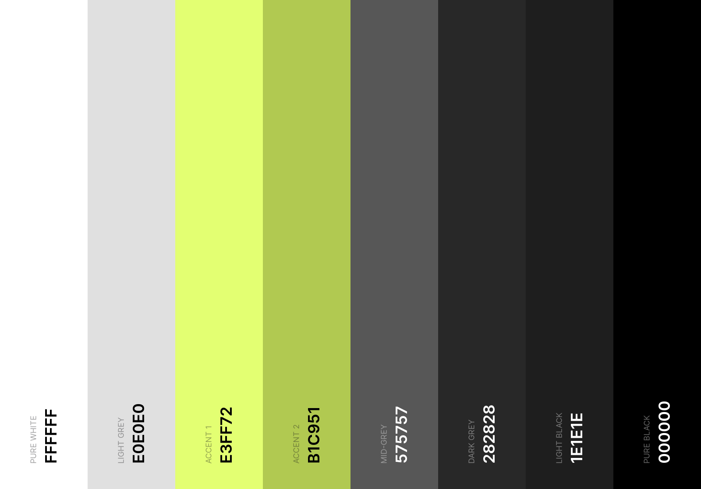

My initial strategy was intimately linked to surface design as I went with a weighty dark-toned colour palette to add gravitas to my content and I then lightened this with a playful throw-pillow of colour. I was also very conscious 
of maintaining colour contrast for accessibility reasons, and my choice of a bright yellow/green fit the brief well. In my initial mock-ups I had planned to use black writing on a dark grey, because I love the rich velvety tone and feel of that 
combination, but I realised early on that the contrast was not user-friendly, so I changed most of my black text to either light-grey or the green/yellow accent colour.

I was also aware of not using pure black as a background colour, I've seen many websites that make this mistake to the detriment of the user. A dark grey that passes for a matte black is always a better base colour, as the contrast
doesn't hurt the user's eyes. For the same reasons I didn't overuse bright white, most of my light tones are actually a very light grey. I also chose a dark grey base with softer brown undertones as it is a warming and comforting colour.

I did detailed colour mock-ups before starting development, but as you can see from the links below I ended up changing some of the pairings.

#### *Mock-ups*

- [Mobile Mock-up](wireframes/mock-up-for-mobile.pdf)
- [Desktop Mock-up](wireframes/mock-up-for-desktop.pdf)

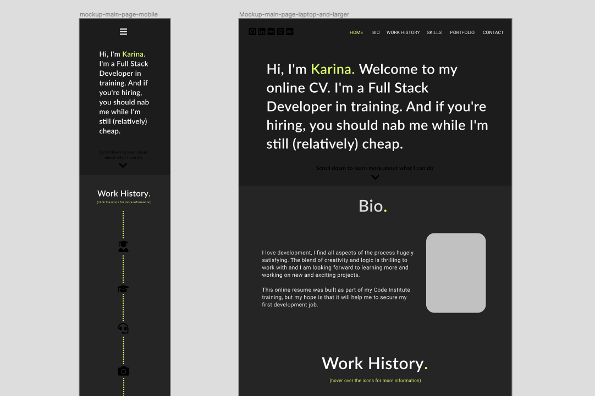

I ended up refining the Portfolio section quite a bit during development but the remaining sections stayed mostly true to my 
wireframing and mock-ups.

#### *Typography*
I focused on using two of my favourite Google fonts: Lato and Roboto. They are clean, elegant, no-nonsense fonts, easy to read, without being boring. I think my font pairing works well for the professional-creative look I was aiming for. Obviously
they are both sans-serif, as are their fallbacks. I experimented briefly with serif fonts during the typography tests, but decided they were not the right fit.   

#### *Use of Language* 
- My landing page language is bold and somewhat brazen, but the idea behind it is to grasp user attention. 
- Throughout the site I use language to reinforce my main goal of securing employment in development:
    - On the landing page. 
    - In the personal bio. 
    - At the end of the work history timeline. 
    - At the beginning of the skills section with a call to download my CV.
    - On the contact page I've used the more colloquial "Get in Touch" to make emailing me appear easy and welcoming.
    - In the footer I have "Connect with me" and links to other places to see my work.
    - Also in the footer I've engaged with the user by asking them a question. "Prefer a more traditional CV?"  This is a well-known sales technique that asks an easy question 
    to illicit a positive response which in turn encourages more subconscious positive responses from the target audience.
- I've kept the language in the main body of the site professional and to the point.

# Features

## 1. Navigation

### Design
The navigation bar is a fixed top horizontal Bootstrap navbar with some key alterations to its default behaviour. 

I used the same colour as my darker background colour so it would blend in nicely with my landing page. I wanted it present, but without detracting from the rest of the pages.

I changed the colour of the Bootstrap hamburger icon to match my site design.

When the navigation bar items are hovered over they scale up in size and a yellow/green bar underlines them.<br><br>

<div align="center">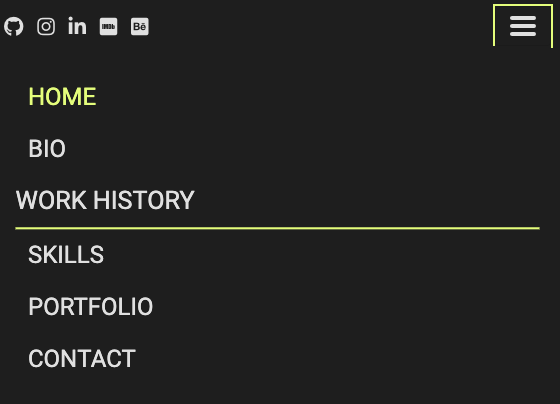</div><br>

I also added content hinting down arrows at key points throughout the site where I felt they were needed. These are animated for extra emphasis.<br><br>
<div align="center">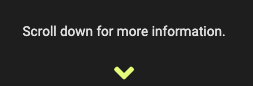</div><br>

### Responsiveness

It is a full-width navbar on screens larger than 992px and then it compresses to a hamburger navigation on smaller screens.

### Elements to Note

- The navbar has been altered via jQuery so that the active class switches from tab to tab as the site is browsed. I found 
<a href="https://stackoverflow.com/questions/24514717/bootstrap-navbar-active-state-not-working" target="_blank">code</a> that achieved this online and I altered it to work on this website.  I was surprised this functionality was not
default with Bootstrap.

- From a UX perspective I found it irksome that a mobile user had to click directly on the hamburger icon to close the navigation, even after tapping on where they wanted to navigate to. Again I found <a href="https://stackoverflow.com/questions/23764863/how-to-close-an-open-collapsed-navbar-when-clicking-outside-of-the-navbar-elemen" target="_blank">code online</a> which I altered 
to work for this website. Now, when a user clicks on a navigation tab, the user is brought to the chosen section and the navigation options close, so they can see the page. 

- Additionally if they click anywhere outside the nav drop-down, it also closes. I think this is preferable to Bootstrap's default behaviour.  

## 2. Landing Page / Home

### Design 
This was designed to be minimalistic with a strong, bold introduction to myself and the site's purpose. Initially I had toyed with adding my profile photo to the landing page, but I prefer the minimalism of just 
text.

The down arrow and concurrent instructions to scroll were added as the landing page takes up the full height of the screen.

<div align="center">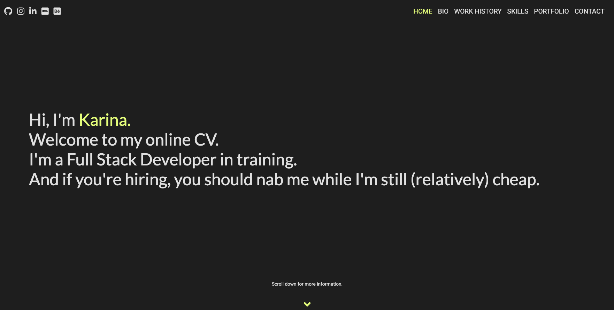</div>

## 3. Short biography & photo of Karina

I wasn't sure about including this page, and I hadn't included it in my wireframes or mock-ups, but I was convinced by both a recruiter and an employer that a basic introduction and photograph would be beneficial, as people like to be able to put a face to the information they are reading.
I was also made aware that this was a good opportunity to expand on my experience in business and wealth of knowledge about SMEs in particular. 

The page is fully responsive and I ensured that I compressed the image, so as not to impact load times unnecessarily.
<br>
<div align="center">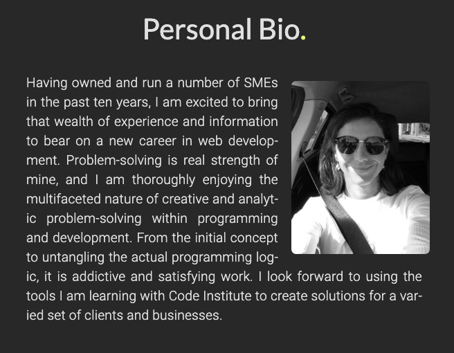</div>
<br>

## 4. Work History

### Design & Concept

This section comprises of an interactive timeline of my education and work history to date. I find employment histories in their usual format to be a little bit tedious, and since I'm also offering a traditional CV for download, I thought it would be
nice to have a little fun with this section. I had (perhaps naively) imagined that I would be able to implement this easily with CSS, but I found that JavaScript was required to get the behaviour I needed. Thankfully the internet is replete with developers 
doing pretty much everything conceivable in JavaScript and I found code that helped me to begin to acheive the desired effect. I had to modify and add to this code to make it work for this website and I drew from multiple sources online (attributed below and in my script.js file). This section went through 
many permutations in order to create an interactivity that was both interesting and different, but also accessible. 

<div align="center">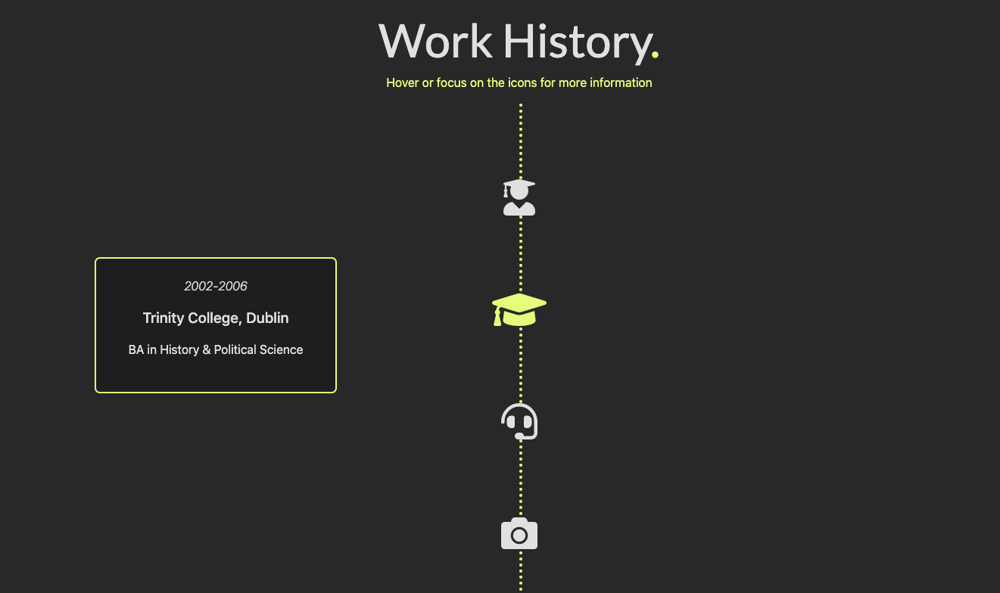</div>

### Accessibility

I was especially aware of the inherent dangers of using hover effects for keyboard users. I have documented the JavaScript in the script.js file, 
so I won't go into the details here. 

To make hovering over the items easier for mouse users, I increased the width of the icon space and as the Font Awesome icons are fonts, the increase in width just enabled me to increase the hover zone without affecting the size of the icon itself.

As this section is slightly unconventional I included an instruction to the user at the beginning of the timeline, to either tap & click or hover & focus (the instruction varies depending on the device used, and screen width). I also ensured that the icons scale up and 
change colour when they are hovered over, as extra confirmation for the user.

Displaying the timeline information to satisfy all potential devices and accessibility categories was complicated. Here were my categories:

- Mouse-using users on desktop screens above 768px wide. 
- Mouse-using users on desktop screens below 768px wide. (Rare but possible). 
- Device-using users on touch screens. 
- Keyboard-using users on desktop screens above 768px wide. 
- Keyboard-using users on desktop screens below 768px wide. 

In addition I needed to account for screen resizing which I discovered introduced more bugs. 

1. __*Instruction to hover & focus or tap & click.*__

- **PROBLEM:** As the work history timeline is not a well-known interaction I felt it was important to supply the user with interaction instructions. This was complicated by the fact that on a mobile device one has to tap and on desktops (generally) one has to hover. I needed
a way to deliver both sets of instructions dependent on the type of interaction the user would have.

- **SOLUTION:** The ```@media (hover:none) {}``` and ```@media (hover:hover) {}``` queries enabled me to display and hide two separate classes that displayed the two separate sets of instructions. 

2. __*Making the information keyboard accessible.*__

- **PROBLEM:** Because the icons are not links they were not tabbable by default. 
- **SOLUTION:** For keyboard users I added ```tabindex="0"``` to each of the icons to make the information accessible.

3. __*Making the X close button keyboard accessible.*__
- **PROBLEM:** Whether or not to make the timeline close buttons keyboard accessible.  
- **SOLUTION:** I decided against implementing this, for the simple reason that were I to add the X buttons to the tabindex, if the keyboard user wanted to read all the timeline information, they would have to tab twice as much to tab through the close buttons. 

4. __*Hiding the icon and timeline line on mobile screens.*__
- **PROBLEM:** Because the timeline information is positioned absolutely, z-index didn't work for hiding the icons and timeline line when the information was displayed. 

- **SOLUTION 1:**  My initial jQuery code used a set of rules to make the icon and timeline line visible and hidden when the corresponding icon was tapped on small screens.
- **SOLUTION 2:**  I then realised that instead of applying the z-index rule to the icon and timeline line, I could apply it to the information itself and that did away with the need to 
hide and show the icon and line. 

## 5. Skills

### Design & Concept
This page features a list of skills that enhance and add to my employability as a professional web developer. As the page is heavy on content, I have made it more accessible by demarcating the various skills into categories and 
further subdividing them into boxes which I think enables the design to flow smoothly and displays the information in a way that is easy to read. I've incorporated a graphical visual in the form of the progress bar graph which 
currently displays more aspirational than factual progress results, but I will update these to reflect my actual progress before I send this website to potential employers. 

### UX
I included a number of elements intended to retain the user's attention: 
- I chose to animate the UX/UI box in a way that both entertains and reinforces the design implication that those particular boxes are "tacked" on to the background.
- I broke up the content into a lot of smaller more manageable pieces that are easier to consume. 
- I sliced through the boxyness of the page with a bright border on the TOOLS section. 
- I added the rather arbitrary progress bars at the bottom to reinforce the idea that I am making headway with a number of languages and technologies. 

## 6. Portfolio

### Design & Concept

The design of this section was inspired by the look and feel of cards in an old rolodex. Just the salient points included, with links to find more detailed information elsewhere.
The goal behind this page is to show my target users what I can do. I have included two extra elements: 
- A link to the live site, if the project has one.
- A link to download the project design specifications to demonstrate the design planning that goes into my work.

Where a project is as yet unfinished, I indicated this by the use of a dashed yellow border, which shows the project's current status.

### Responsiveness & Images
The section is fully responsive and flips between three different designs:

1. The elements stacked on top of each other on small screens. 
2. The elements stacked but diagonally opposed on medium and screens up to 992px.
3. The elements in a single horizontal card. <br><br>

<div align="center">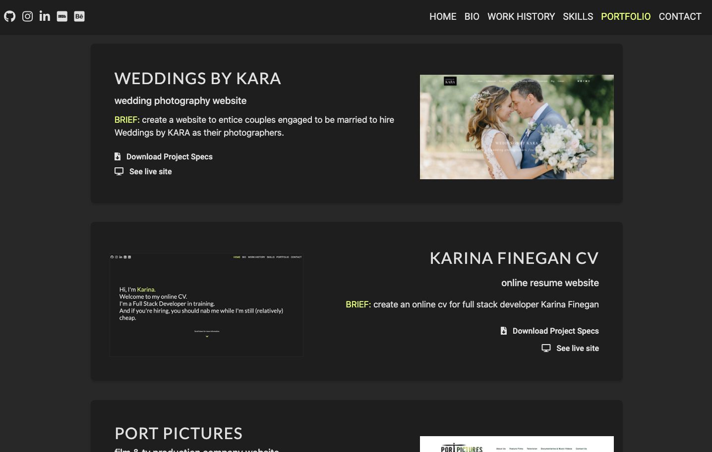</div>
<br><br>
I used CSS Grid to get the advanced level of flexibility I required for this page, and I set my images to ```width:100%``` with ```height:auto``` to ensure full responsiveness across 
screen sizes. I also sized my images very specifically to suit the design without being too large, and then I gave them a ```max-width:450px``` to keep them from pixelating. 


## 7. Contact Page / Get in Touch

The aim for this page was for it to be eye-catching and simple. The form itself takes up most of the page and the heading is somewhat colloquial to encourage use.  

I also included a content hinting down arrow to lead users to the footer, because if you navigate to the contact form directly from the navbar, it is not immediately obvious that you can scroll 
further.

## 8. Footer

My footer is designed using CSS Grid to help it change layout on small, medium and large screens. 

I made the choice to include both my social navigation and my main navigation in the footer as well as via the main nav-bar. 
I am aware that this might be considered somewhat redundant given that my main navbar is fixed and easily accessible from the footer area, however 
I persisted with this decision, because on small screens and medium screens up to 992px, the main navigation is hidden behind the hamburger icon and the upper social media links are 
quite small, thus easily ignored. 

Ultimately I didn't think the downside of redundancy outweighed the positives of potentially reminding a user to connect with me on social media, or have another look at part of my website.
I included both of these CTAs as titles over the footer navigation. I did however remove the main navigation links from the footer on screens above 992px as at this size the navbar is completely visible. 

<div align="center">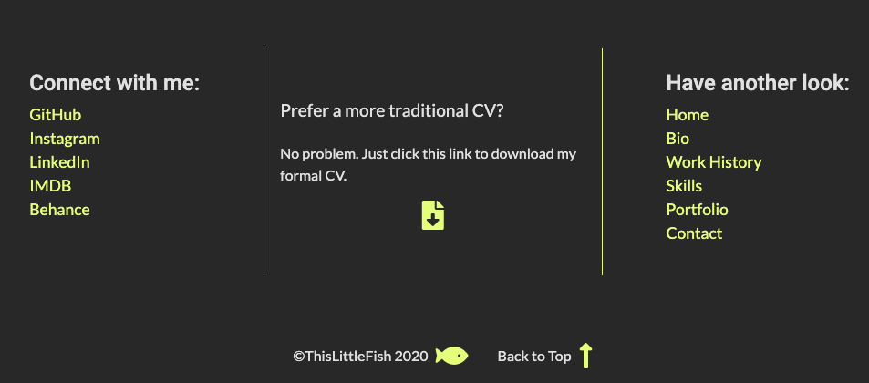</div>

# Accessibility

In addition to the elements I've already discussed in previous sections of this README, I did the following to ensure accesibility across the board:
* My original design had far more dark on dark toned elements, which I love the look of, but after having checked the site and colour themes using the Web Disability Simulator,
I realised my colour choices were problematic for a subsection of potential users. So I chose to use more of the light grey and yellow tones for text elements.

* After running my site through web.dev I found that I need to add aria-labels to a multitude of elements to ensure good accessibility. 

* I added descriptive alt text to all my images. 

* I added a "Skip to Main" link before my nav bar that was absolutely positioned off screen until tabbed and then it appears and is very obvious. <br><br>
<div align="center">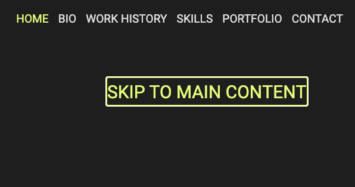</div>
<br>

* I ensured readability for those hard of vision, by ensuring that the entire site was readable up to 200% zoom. 

* I had initially changed the inputs on my contact form so that when a user clicks into an input to type, the placeholder would disappear.
I wrote it like this because I personally find it off-putting to type over something already written. However, I then researched placeholder 
functionality online and found that this was not acceptable HTML standard in terms of usability, so I changed it back to the default behaviour. 
It is important to see the placeholder text right up until a user types, especially when not including form labels, which I have chosen to omit for design reasons.
<br><br>
<div align="center">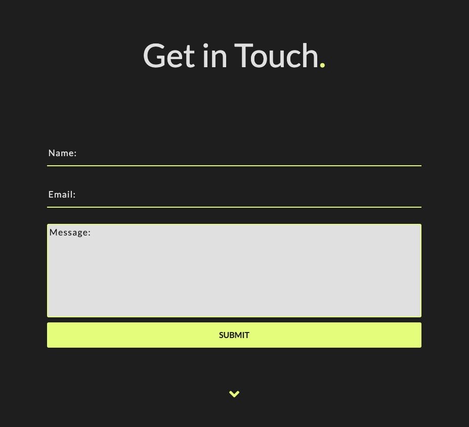</div>
<br>

* Because I am not including form labels, I was careful to include the aria-label for each element of the form to make them available to screen-readers. 

# Future Features to Implement

* As per my mentor's suggestion I plan to turn this website into a dynamic site, whereby specific project pages are generated dynamically after inputting certain key variables. Title, goal, colour palette, typography images etc... 
This will be controlled and organised from a central CMS.

* I plan to implement the sequential loading of elements on scroll. So as the user scrolls down elements pop into view.

* I plan to password protect my downloadable traditional CV, as I don't want all my personal details to be readily available online.

* I plan to make the contact form functional. 


# Testing 


## Code Validators

I used a number of code validators to check my code:

 [W3 HTML Validator](https://validator.w3.org/)

- It threw an issue with the fact that I gave my timeline icons aria-labels: 

    However, since "[The purpose of this technique is to provide a label for objects that can be read by assistive technology. The aria-label attribute provides the text label for an object, such as a button. When a screen reader encounters the object, the aria-label text is read so that the user will know what it is.](https://www.w3.org/TR/WCAG20-TECHS/ARIA6.html#:~:text=The%20purpose%20of%20this%20technique,will%20know%20what%20it%20is.)"
    

    It was important to include them on the icons as they are integral to understanding the work history timeline. 

- It threw an issue with my use of h1 tags. 

    "Consider using the h1 element as a top-level heading only"<br>
    
    However as this site is a long scroll page, each section does represent a different page, and since the explanation for limiting h1 use is that
    screen readers use them to direct users, the best thing to do for screen reader is to leave them in place. 

 [W3 CSS Validator](https://jigsaw.w3.org/css-validator/)

 - Threw a number of "Parse Errors" in relation to my colour variables but following research I discovered that the W3 Validator seems to be somewhat
 out of touch with CSS3. Please see this [Stack Overflow Discussion](https://stackoverflow.com/questions/57661659/w3c-css-validation-parse-error-on-variables) for details. So I've ignored these and
 the rest of the code was valid.

 - It also threw warnings about unknown vendor extensions, but again as with the above I have read that this is a non-issue. 

 - The rest of the code validated. 

 [W3 Link Checker](https://validator.w3.org/checklink)
    - Found a few broken links and fixed typos.
 
 

## Testing User Stories 
#### *Project-Developer* 

As the sole stakeholder in this project, I am happy that my requirements for this project have been met. Once I link up my contact form, I am happy to begin using this website to showcase my work. 

#### *Applicable to both target users*

* GOAL: *As a user I would like to be able to quickly and easily understand the purpose of this website.*

    - FULFILLMENT: The first thing users are greeted with is a clear introduction that perfectly encapsulates the website's purpose.

* GOAL: *As a user I want to be able to easily navigate this website, using a mouse or a keyboard, or screen reader technology.*

    - FULFILLMENT: The website is fully responsive and accessible by keyboard, mouse and screen-readers.

* GOAL: *As a user I would like to view this candidate's work and education history.*

    - FULFILLMENT: This is easily accessible for all users via the interactive timeline.

* GOAL: *As a user I would like to know what languages this candidate is able to work in.*

    - FULFILLMENT: These are laid out in the skills section in writing and through the use of progress bars. 

* GOAL: *As a user I would like to see examples of projects this candidate has developed.*

    - FULFILLMENT: The portfolio section fulfils this goal.

* GOAL: *As a user I would like a way to contact this candidate.*

    - The contact form achieves this. (Well... it will, once it is fully functional)

#### *Tech Recruiters*

* GOAL: *As a recruiter for a large firm, I am always looking for new talent to send my clients.*
    
    - FULFILLMENT: The site has been designed to present me as a potential candidate for employment.

* GOAL: *As a recruiter I have many clients who are looking for developers. I'd like to be able to quickly browse an online resume to get a general sense of whether or not this particular developer might be a good fit for any of my clients.*

    - FULFILLMENT: While not too brief, the site is designed so as to lay out the essential information in easily accessible sections that can be browsed in their entirety or skim-read.

* GOAL: *As a tech recruiter I'm not always 100% certain what languages or tools my client requires, so I would like the ability to download a detailed CV that clearly outlines the candidate's skills.*

    - FULFILLMENT: A traditional CV is available for download from the footer of the website.

* GOAL: *As a tech recruiter I want to know about the specific skills a candidate has and whether they apply to SMEs or large corporations.*

    - FULFILLMENT: The personal bio touches on my experience working for and as an SME, and the work history timeline and downloadable CV further emphasises this.


#### *Employers*

* GOAL: *As an employer looking for a new full stack developer to join my team, I find online resumes incredibly useful to get a broad sense of someone's capabilities.* 

    - FULFILLMENT: The website clearly outlines my development experience and my goals for further learning in that field.

* GOAL: *As an employer I would like a more detailed CV to further help me decide whether or not to call that candidate for interview.*

    - FULFILLMENT: This is available to download from the footer of the website.

* GOAL: *As an employer looking for a new front end developer, I am heartened to see an online CV built by that potential candidate because it is an instant assurance that they know how to design and build a website.* 

    - FULFILLMENT: The site is an online CV, built by its subject.

* GOAL: *As an employer who shares decision-making with others I like how easy it is to send that CV to other members of my organization as a way of fielding potential candidates.*

    - FULFILLMENT: The website is deployed correctly and thus can be shared easily via url. 

* GOAL: *As an employer I would also be interested in seeing the code behind this candidate's other projects. A link to the associated GitHub accounts is very useful to me.*

    - FULFILLMENT: There is a link to my associated GitHub account in the top and footer navigation of the site, where all this code is available to examine.

* GOAL: *As an employer who runs an SME I would like an online portfolio to tell me what experience a candidate has specific to my type of business.*

    - FULFILLMENT: This information is outlined in the biography, the work experience timeline, the skills section and in my downloadable traditional CV.

#### *Returning Visitors*

* GOAL: *As a returning user, I want to see if there are any new portfolio examples on display.* 

    - FULFILLMENT: As I complete new projects, I will be updating the portfolio section, as well as eventually making it dynamic. 

* GOAL: *As a returning user, I want to see if there are new additions to this candidates GitHub account.*

    - FULFILLMENT: Again easily accessed via the links. 

**IN SUMMARY:** 

My primary goal was to create a website that showcases and communicates my skills and employability in a modern and interesting way and I feel that the project has acheived this.

Users can browse, see my work history and education, they can see a number of projects I have already completed and others I am currently working on, and they can download project specifications for a greater insight into 
how I work. I have also expounded on my experience working within and running an SME. A USP that makes me especially qualified to work for other SMEs. Users also have the ability to download an in-depth CV and examine my coding in
more depth should they want to, via the GitHub links.

## Mobile-first Responsivity

I designed and wrote this site using a mobile-first approach. 

### Mobile/xs & sm breakpoints 
- Most elements are stacked vertically on top of each other. 

- On xs and sm screens the work history timeline information is designed as a kind of modal pop-up that obscures the background beneath them using z-index.

- The Work History timeline must be tapped or clicked for functionality and has X close buttons, although clicking
or tapping anywhere on the page will close the information boxes. 

- As per my mentor's advice, when the information is displayed on small screens I used jQuery to create a blurred background effect to focus the user solely on the 
timeline information.

<div align="center" >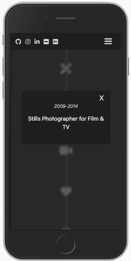</div><br>


- The Skills page is simplified by removing the dark grey boxes from around the skills and languages information.
As they are not all visible on the page together, those boxes were not needed. 

<div align="center" >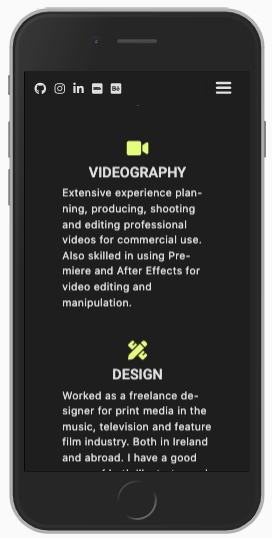</div>

- I also removed the progress bars from xs and sm breakpoints. The languages represented by the bars are mentioned in the paragraph before them and 
the effect of the progress bars works better when there is space to view them. 

- On xs screens my portfolio page stacks the elements vertically and then on sm screens it begins to separate the images from the 
text horizontally/diagonally while retaining a vertical alignment. 

<div align="center" >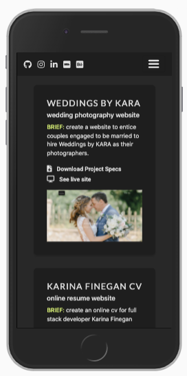</div>

- Each element of my contact form takes up their own horizontal space and this does not change as the screen widens, it just gets proportionately wider.

- My footer stacks vertically, starting with the most important element which is my cv download, followed by my social media links and then my navigation links. 

<div align="center" >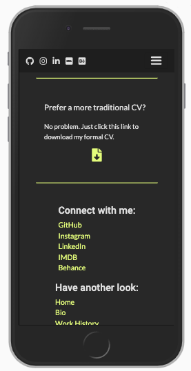</div>

### Md breakpoint

- The navigation is still toggled by the hamburger icon at this size. 

- The first major shift here is that my work history timeline goes from a modal design to more of a tool-tips design. The information is displayed on hover or focus (for desktops) and the boxes 
now sit on either side of the timeline and are bordered with my accent colour and no longer contain an X close function. 

- The skills section is also redesigned at this breakpoint. The individual skills are now two to a line, and they get a dark grey box effect and the UX/UI box is animated for extra pzazz. The layout inside the boxes
is also changed from being centered to being absolutely positioned. I also applied a box-shadow to the grey skill boxes to add to the effect.

<div align="center" >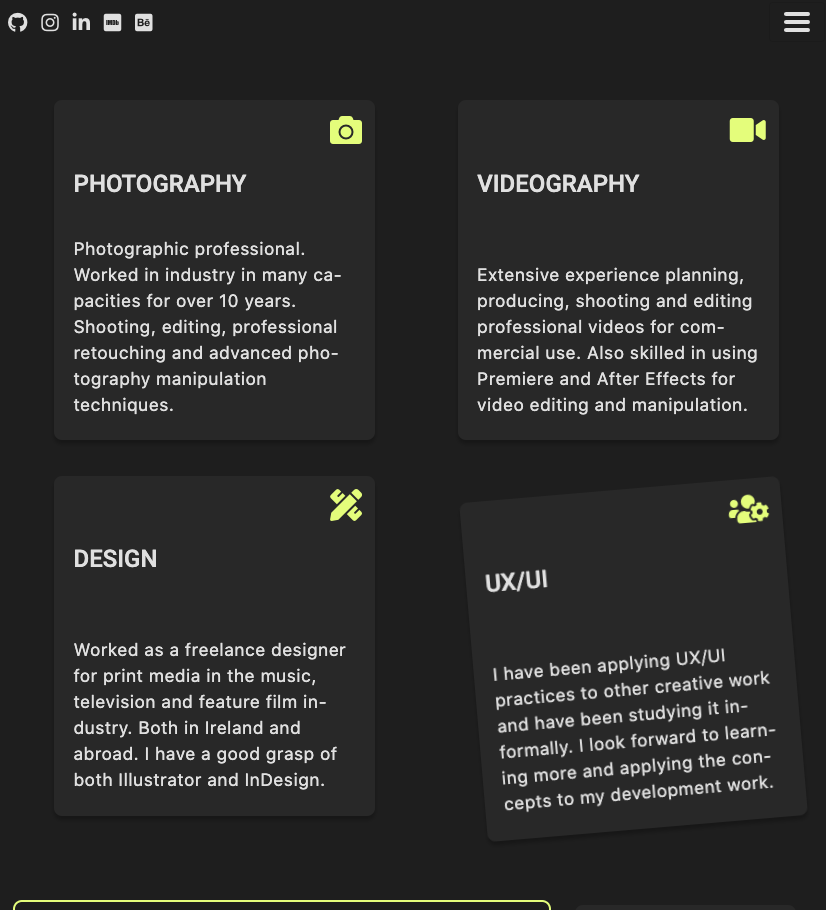</div>

- The dividers I included to delineate the skills sections are also unnecessay and thus removed at this breakpoint.

- The progress bars appear at this breakpoint, because the page is now wide enough to accomodate them comfortably and without confusion. 

- The Portfolio section continues to stack vertically, but the staggered opposing alignment of the text and images becomes pleasingly obvious. <br>

<div align="center" >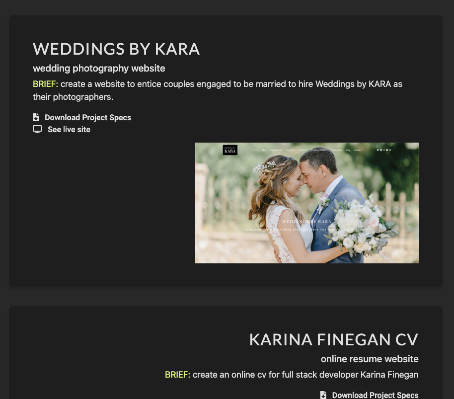</div><br>

- The Footer is now horizontally aligned with dividers and both sets of navigation are included, as the main navigation is still hidden behind the hamburger icon. <br>

<div align="center" ></div>

### Lg breakpoint

- The main navigation becomes a full horizontal fixed top nav-bar. 

- The first four skills' boxes now sit next to each other sharing a single line of layout. 

<div align="center" >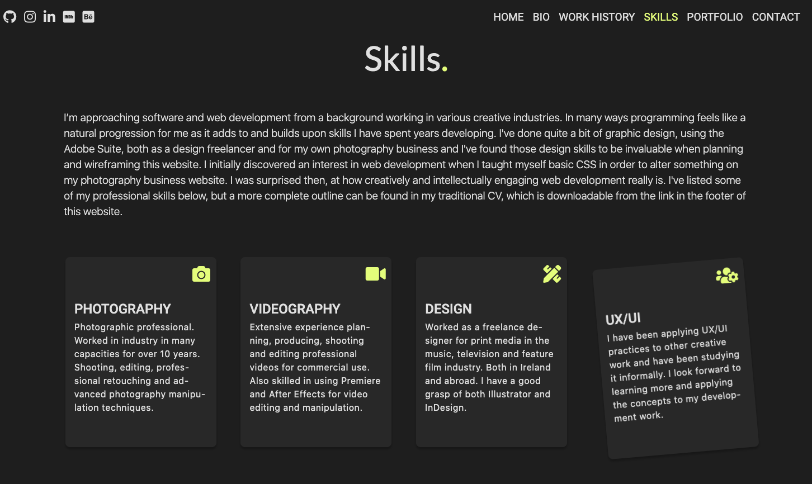</div>

- The individual projects are now laid out in a more horizontal way and the images sits next to the text.

- In the footer, I remove the main-navigation footer links as the top navigation is sufficiently obvious.

### Xl breakpoint

- No major layout changes, just minor spacing adjustments. 

## Manual Testing

I manually tested every section and link myself before sending it out to friends and family. 

1. I tested the website layout at different breakpoints to ensure it looked good on every browser. I used: Chrome, Safari, Opera, Firefox, Firefox Nightly, all of which I have installed on my local machine.

2. I then tested the website on my iphone6, and my partner's ancient and tiny iphoneSE as well as my ipad mini. 

3. I tested the contact form:

    - I tried to submit an empty form to ensure I received a prompt to fill in the required fields.
    - I filled in all permutations of fields, leaving one required field empty each time to make sure I was always prompted to fill in the empty field.
    - I filled in a wrongly formatted email address to test that the user would be prompted to fill in a valid email address. 

    The contact form passed these tests. 

4. I manually checked each link, to make sure they were all opening in a new window and to the correct address.

5. I checked that all the internal navigation was working as it should. 

I then sent the page to friends and family, who used a range of different devices both android and apple, alongside a range of 
different desktops and operating systems. 

There were some design tweaks to be made as a result of this, mostly increasing and decreasing font sizes until I reached a happy compromise. 

## Bugs & Fixes

As a result of manual testing on my local machine I came across a number of bugs (mostly jQuery related):

### Navigation 
1. **_Navbar Active Class on Scroll_**
- BUG: As the user scrolls down or up the page, the active class was not changing from link to link.

- FIX: I found jQuery code online that implemented this.(Attributed below).

2. **_Navbar Active Class on Scroll - part deux_**
- BUG: I realised that although the code worked, a user had to scroll a good bit past the heading to cause the active class to change, and as a result
when you clicked on say 'Portfolio' the navigation brought you there, but the 'Skills' section was still claiming to be the active class through the yellow link colour.
- FIX: I added 100px on to the required scroll position, so that it needed less space to apply the rule. 

    ```if (refElement.position().top <= (scrollPos + 100) && refElement.position().top + refElement.height() > scrollPos)...```
 
 <div align="center" >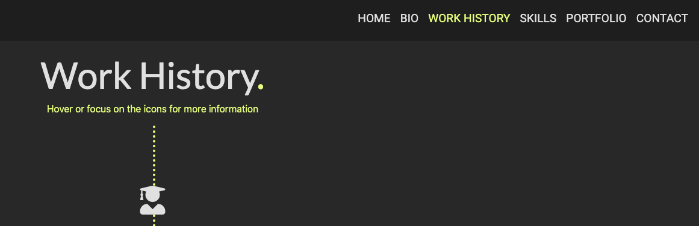</div>

### Landing Page & Contact Page
1. **_Accessibility Bug on Page Zoom._**
- BUG: As I began testing the site on different devices, zoomed in to 200% as stipulated by HTML official standards, I found that on certain screen sizes both the landing page and the contact page were not working as expected. The writing on the landing page 
was disappearing above the page, so that the user would not be able to read the first line. The contact form itself was seeping into the footer, obscuring most of it. 

- FIX: I had set the heights of both sections to height: 100vh. Changing them to min-height: 100vh fixed the issue.  
<div align="center" >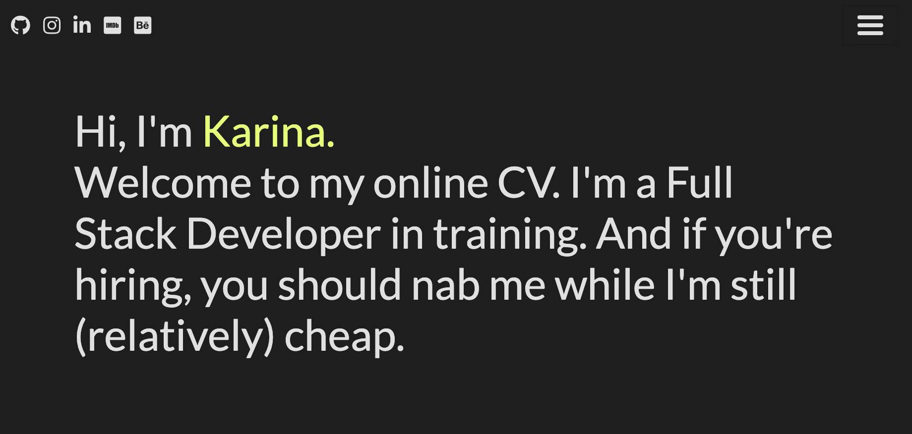</div>

### Work History

1.  **_Timeline Information Flickering._**

- BUG: My original code displayed and hid the timeline icon on hover, which worked fine where there was no overlap between the information and the icon as on larger screens. However on small screens the act of hiding the icon was telling the
code that the icon had been "moused off" or unhovered and thus was hiding the timeline info and showing the icon again, but then immediately showing the information and hiding the icon again and this loop resulted in an annoying flickering effect. 

- FIX: Instead of allowing hover on smaller screens I switched the functionality to a click and I changed how I coded the icons, instead of hiding and showing them, I used z-index to hide and show the timeline information itself which avoided the 
flickering issue completely. 

2. **_Resizing the Page._**

- BUG: Once I had my jQuery code working, I had divided the logic between small and large screens, but when the screen was resized the original screen size code was carrying over and causing the info to appear incorrectly.
- FIX: I used ```$(window).resize``` and wrapped the info function inside it.

- BUG: While this worked for resizing from small screens to large screens, the reverse was not true. When a user would resize to a small screen the large screen code would still carry over.
- FIX: I added code to reload the page on resize, which forced the specific screen size jQuery code and all seemed good...

- BUG: ...Except then I noticed that on mobile devices it was registering page scroll as a vertical window resize, and reloading and jumping back to the top every time a user tried to scroll. Not ideal.
- FIX: I used code found online and altered the resize function to include a width property. So if the window width was different to the last window width, then it would reload and this fixed the vertical scroll issue. 

3.  **_The animated sun icon._**

- BUG: The sun has no timeline information attached, its function is aesthetic, yet because my code targeted the ```".timeline-icon"``` class, it was included in the blur and darken function.
- FIX: To stop this, I added a conditional statement removing the blur and darken function from the sun specifically.

<div align="center">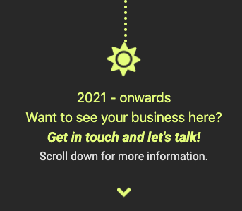</div>

## Other Testing

### 1. [web.dev Measure](https://web.dev/measure/)
This was amazing for checking a range of different measures of page performance, accessibility, vulnerabilities and best practices. 
I went through the list a few times and changed/altered elements on my page to try and improve those markers of performance that I could.

* I altered my code so that my headings descended sequentially. Initially I had skipped from h1s to h4s in a number of sections. 
* I added rel="noopener" to my target="_blank"'s as per their recommendation.
* I used Chrome's development tools' "Coverage" tab to see how much unused CSS I had, but then chose to leave it for the time being as it does not impact substantially 
on page load time, although for larger projects it is definitely something worth considering re: external libraries. 
* I added a meta description. 

### 2. [Browser Stack](https://www.browserstack.com/)

Amazing cross-browser testing tool. I used their free plan and tested my website on all major browsers and devices. 

Using this tool I found that the website looks awful on Internet Explorer. IE does not support the use of CSS3 variables. So none of my colours register.
However, given that global usage of IE is < 1.6% *and* Microsoft just announced that they are retiring IE completely, I've chosen to ignore this, as I don't imagine any of my target audience 
will be using IE.

Safari v9 and earlier also do not support CSS3 variables, but again usage of these old browsers is low, and it is unlikely that web development employers are using such old software.

### 3. [Can I use?](https://caniuse.com/usage-table)

I used this during testing to work out why my website looked so bad on older versions of safari and IE. CSS3 variables were to blame.
My website colour variables are supported by 94.75% of browsers globally, according to "Can I use?".

### 4. [Chrome Developer Tools](https://developers.google.com/web/tools/chrome-devtools)
I used the Chrome Dev Tools in browser to test the site's responsiveness across a range of screens sizes and device types.

### 5. [Responsive Viewer](https://chrome.google.com/webstore/detail/responsive-viewer/inmopeiepgfljkpkidclfgbgbmfcennb?hl=en)
I used this Chrome Extension to further test the website across a range of devices and screen sizes. 
<div align="center">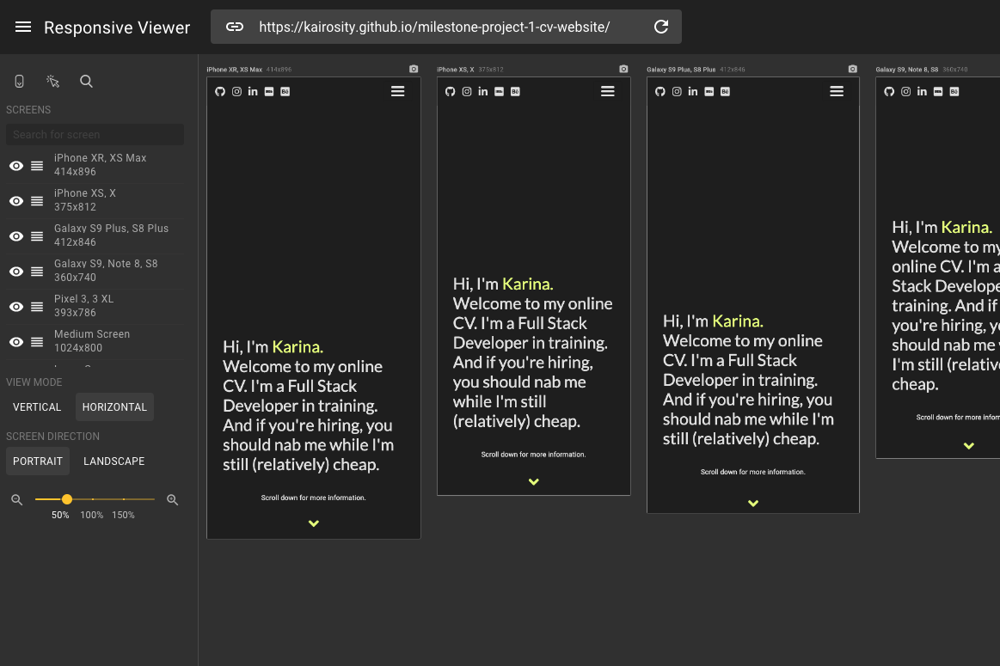</div>

### 6. [Chrome Dev Tools: Lighthouse](https://developers.google.com/web/tools/lighthouse#psi)
Similar to Measure - this set of tools is amazing for showing where aspects of your site can be improved. My site scores highly with one or two
future alterations to make:

<div align="center">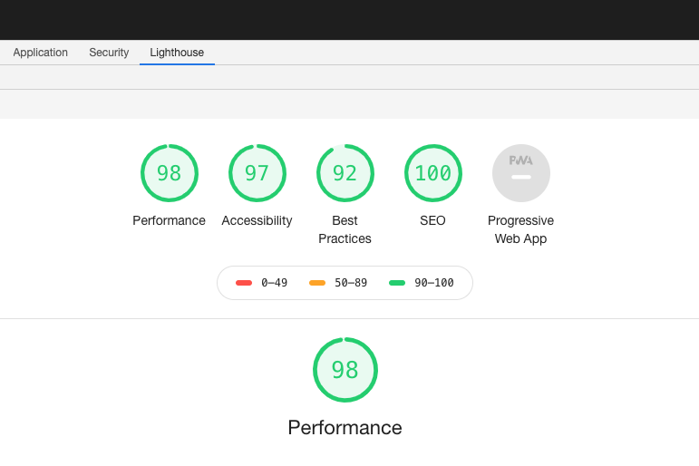</div>


# Issues / Room for Improvement

* *Unused CSS*: As per web-dev Measure results I tested my CSS via Chrome dev tools' "Coverage" tool and found that there was a substantial amount of unused CSS.
For this particular site, the load time is quite fast, so I don't think this is a massive issue, but there is definitely scope for reducing the size of the Bootstrap and Font Awesome libraries.

* *Cache Policy*: As per Chrome Dev Tools: Lighthouse - I need to "serve my static assets with an efficient cache policy" but as this is beyond the scope of this project I will implement this at a later date, when I know more server-side programming.

* *Add A Service Worker to My Project* As per web-dev (Lighthouse) - I should make my page Progressive by adding a service worker, so it responds with a 200 when offline.


# Attribution

#### [Will Chow's jQuery Code.](https://jsfiddle.net/wilchow/4hzenxkh/) 
The jQuery code I used and altered to display the Work History Timeline information on hover/click.  

#### [@dynamyc-2's jQuery code](https://css-tricks.com/forums/topic/jquery-window-width-condition/)
I used and altered the first line from this user's question on CSS Tricks, to make my work history timeline logic work.  

#### [Taha Paksu's Code from Stack Overflow](https://stackoverflow.com/questions/10750603/detect-a-window-width-change-but-not-a-height-change)
I used this code to stop the browser reloading on mobile devices when a user scrolls vertically. 

#### [Mitra's Code from Stack Overflow](https://stackoverflow.com/questions/50668594/remove-border-color-for-navbar-toggler-hamburger-icon-bootstrap-4)
I used this user's answer (2nd from top) to change the colour of my bootstrap hamburger icon when active or focus states were triggered. 

#### [Pete TNT's Code from Stack Overflow](https://stackoverflow.com/questions/24514717/bootstrap-navbar-active-state-not-working)
I used and altered this code to make my Bootstrap navbar work the way it should regarding the active class.

#### [Nozzleman's Code from Stack Overflow](https://stackoverflow.com/questions/23764863/how-to-close-an-open-collapsed-navbar-when-clicking-outside-of-the-navbar-elemen)
I used and altered this code to make the navbar close when a user clicks away from it on mobile devices. The Bootstrap default is that you have to click on the hamburger icon to 
close the navigation, and I question how user-friendly this is. In addition, the Bootstrap default behaviour is that even when a user clicks on a navigation link, the navigation
stays open and they have to click the icon to close it. I think this code improves upon the default behaviour. 

#### [Alexandr Malyita's Code on Stack Overflow](https://stackoverflow.com/questions/41630229/how-to-change-the-active-class-on-scroll-in-bootstrap-using-jquery)
I altered this only slightly to implement this code which changes the active class on the navbar when a user scrolls through the pages.

# Deployment

This website was developed using GitPod in a Chrome browser and commits were pushed to a GitHub repository.
This site is currently hosted on GitHub pages. 
## How I Published to GitHub Pages:

1. I went to the main page of my [GitHub repository.](https://github.com/kairosity/milestone-project-1-cv-website) 
2. I clicked on the "Settings" tab on the main horizontal tab bar.
3. I scrolled down to "GitHub Pages".
4. I selected "Branch: Master" and the "Root" Directory and then clicked "Save".
5. Site Published. 

## To fork this GitHub repository:

1. Log into GitHub and locate [this repo](https://github.com/kairosity/milestone-project-1-cv-website).
2. At the top right-hand corner of the page find and click the "Fork" button.<br></br>
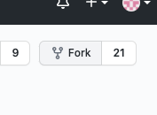
3. You have forked this repository.

## To open this project locally:

To open this project locally you have to clone the project on GitHub, you can do this via the Command Line or using GitHub Desktop.

### Using the Command Line

1. Go to the main page of [this project's repository on GitHub.](https://github.com/kairosity/milestone-project-1-cv-website) The page with the full list of files and the README doc underneath.

2. Click on the button that says "Code" with a down arrow before the text.

3. To clone using HTTPS click the clipboard icon pictured next to the repository link.

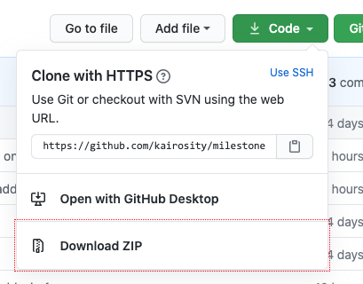

4. To clone using SSH click the blue link on the upper right hand side that says "Use SSH" and then click the clipboard icon to copy. 

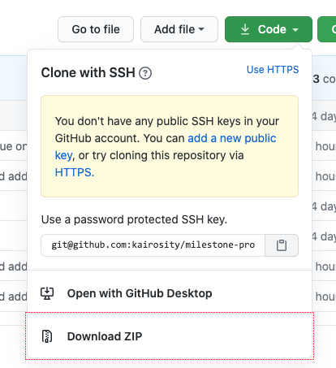

5. Here is some more information on [which remote URL to use](https://docs.github.com/en/github/using-git/which-remote-url-should-i-use) if you're not sure.

6. In your IDE or directly in your terminal, navigate to the directory that you would like the cloned project to live in.

7. Type git clone and paste in the URL you copied in step 3 or 4.

8. Press enter to create a local clone. Done!

### Using GitHub Desktop

1. Go to the main page of [this project's repository on GitHub.](https://github.com/kairosity/milestone-project-1-cv-website) The page with the full list of files and the README doc underneath.

2. Click on the button that says "Code" with a down arrow before the text.

3. Click on "Open with GitHub Desktop".

4. Follow the prompts provided by GitHub Desktop.

# Tools & Other Resources Used & Perused
Here are the additional tools and resources I used during all stages of this project: 

## 1. Design

- ### **[Awwwards](https://www.awwwards.com/)**
    Browsed for design inspiration. 

- ###  **[Figma](https://www.figma.com/)**
    My project planning, wireframes initial colour palette & typography testing were all done using Figma.

- ### **[Adobe Photoshop](https://www.adobe.com/ie/products/photoshopfamily.html)**
    Editing and colour correction for the images were done using Adobe Photoshop.

- ### **[Adobe Colour](https://color.adobe.com/create/color-wheel)**
    Used this resource for colour inspiration and testing colour combinations. 

- ### **[Coolors](https://coolors.co/)**
    Used to generate the colour palette image displayed in this README.

- ### **[Unsplash](https://unsplash.com/)**
    Specifically:<br>
    * <span>Photo by <a href="https://unsplash.com/@bekirdonmeez?utm_source=unsplash&amp;utm_medium=referral&amp;utm_content=creditCopyText">Bekir Dönmez</a> on <a href="https://unsplash.com/s/photos/acupuncture?utm_source=unsplash&amp;utm_medium=referral&amp;utm_content=creditCopyText">Unsplash</a></span>
    * <span>Photo by <a href="https://unsplash.com/@lougoetzmann?utm_source=unsplash&amp;utm_medium=referral&amp;utm_content=creditCopyText">Lou Goetzmann</a> on <a href="https://unsplash.com/s/photos/ireland-history?utm_source=unsplash&amp;utm_medium=referral&amp;utm_content=creditCopyText">Unsplash</a></span>

- ### **[Google Fonts](https://fonts.google.com/)**

  Both fonts included are Google Fonts: Lato & Roboto.

- ### **[Font Awesome](https://fontawesome.com/)** 

  All the awesome icons used are from Font Awesome.

- ### **[Image Optim](https://imageoptim.com/mac)**
    Great little program to compress images for use online.

- ### **[Multi Device Website Mockup Generator](https://techsini.com/multi-mockup/index.php)** 
    Used for the first image of this README.

## 2. HTML & CSS Code
- ### **[Chrome Dev Tools](https://developers.google.com/web/tools/chrome-devtools)**

    Used a LOT for testing CSS and shaping the jQuery code to work for my project.

- ### **[W3 CSS Validator](https://jigsaw.w3.org/css-validator/)** & **[ W3 HTML Validator](https://validator.w3.org/)**
    I ran my code through these validators to check it.

- ### **[W3C Editor's Draft](https://drafts.csswg.org/mediaqueries-4/#hover)** 
    Great information on using :hover media queries.

- ### **[Autoprefixer - CSS](https://autoprefixer.github.io/)**
    Amazing tool that adds all the browser prefixs automatically.

- ### **[CSS Tricks](https://css-tricks.com/)**
    Specifically their pages on:

    * [Box Shadows](https://css-tricks.com/almanac/properties/b/box-shadow/https://css-tricks.com/almanac/properties/b/box-shadow/)
    * [Flexbox](https://css-tricks.com/snippets/css/a-guide-to-flexbox/)
    * [Grid](https://css-tricks.com/snippets/css/complete-guide-grid/)
    * [TextArea](https://css-tricks.com/textarea-tricks/)
    * [Unused CSS](https://css-tricks.com/how-do-you-remove-unused-css-from-a-site/)

- ### **[freeCodeCamp](https://www.freecodecamp.org/)**
    Specifically [This article](https://www.freecodecamp.org/news/time-saving-css-techniques-to-create-responsive-images-ebb1e84f90d5/) about all the ways to create responsive images. 

- ### **[dirtyMarkup by 10 Best Design](https://www.10bestdesign.com/dirtymarkup/)**
    HTML, CSS, JS & API code formatter. Super useful resource thanks to Richard Read (Readri205 @ Code Institute) for the link. 


## 3. jQuery Code
- ### **[jQuery Documentation](https://api.jquery.com/)**
    Helped me get started using jQuery.

- ### **[CSS Tricks: Learn jQuery from Scratch](https://css-tricks.com/lodge/learn-jquery/)**
    Great starter guide.

- ### **[How To Write Comments in JavaScript](https://www.digitalocean.com/community/tutorials/how-to-write-comments-in-javascript)**
    Useful for reference.

## 4. Accessibility, Performance & Testing
- ### **[Chrome Dev Tools: Lighthouse](https://developers.google.com/web/tools/lighthouse#devtools)**

    Amazing for checking a number of site performance indicators. 

- ### **[Web Disability Simulator - Chrome Extension](https://chrome.google.com/webstore/detail/web-disability-simulator/olioanlbgbpmdlgjnnampnnlohigkjla?hl=en)**
    Used this to check my design and page layout for accesibility concerns. 

- ### **[Can I Use?](https://caniuse.com/)**
    Checks web development features for browser compatibility. 

- ### **[Google's Web.Dev Measure](https://web.dev/measure/?gclid=EAIaIQobChMIk-icrKKb6wIVQeztCh2zaAQFEAAYASAAEgKVJfD_BwE)**
    Useful for testing various site performance and user experience markers.  

- ### **[Access & Use](https://accessuse.eu/en/Content-hover-focus.html)**
    Information on hover/focus based accessibility.

- ### **[Dreamhost Blog Article](https://www.dreamhost.com/blog/make-your-website-accessible/)**
    10 ways to make your website more accessible.

- ### **[Aria-Labels](https://www.w3.org/TR/WCAG20-TECHS/ARIA6.html#:~:text=The%20purpose%20of%20this%20technique,will%20know%20what%20it%20is.)**
    Used to understand how and when to use aria-labels.

- ### **[Responsive Viewer](https://chrome.google.com/webstore/detail/responsive-viewer/inmopeiepgfljkpkidclfgbgbmfcennb?hl=en)**
    Used to test the website across different screen sizes and devices. 
## 5. General Resources

- ### **[Table of Contents Generator](http://ecotrust-canada.github.io/markdown-toc/)**
    Used to generate this GitHub TOC.

- ### **[Google's Style Guide](https://google.github.io/styleguide/htmlcssguide.html)**
    Useful reference for formatting/style information.

---

# Technology Used

* HTML5

* CSS3

* Bootstrap

* jQuery

* GitHub

* GitPod

* Git 


# Acknowledgements

Thank you to my friends and family for doing usability testing for me on various devices, and for giving me feedback. <br>
Special thanks to Cristina Cista for her professional input.<br>
Thank you to my Mother for proof-reading this README, even though she has [```-infinity```](https://www.w3schools.com/JSREF/jsref_infinity.asp) interest in web development. :)<br>
Thanks to the Code Institute Slack Community for their resources and information. <br>
Thank you to my Code Institute mentor [Oluwafemi Medale](https://github.com/omedale) for his invaluable insight and instruction. 


